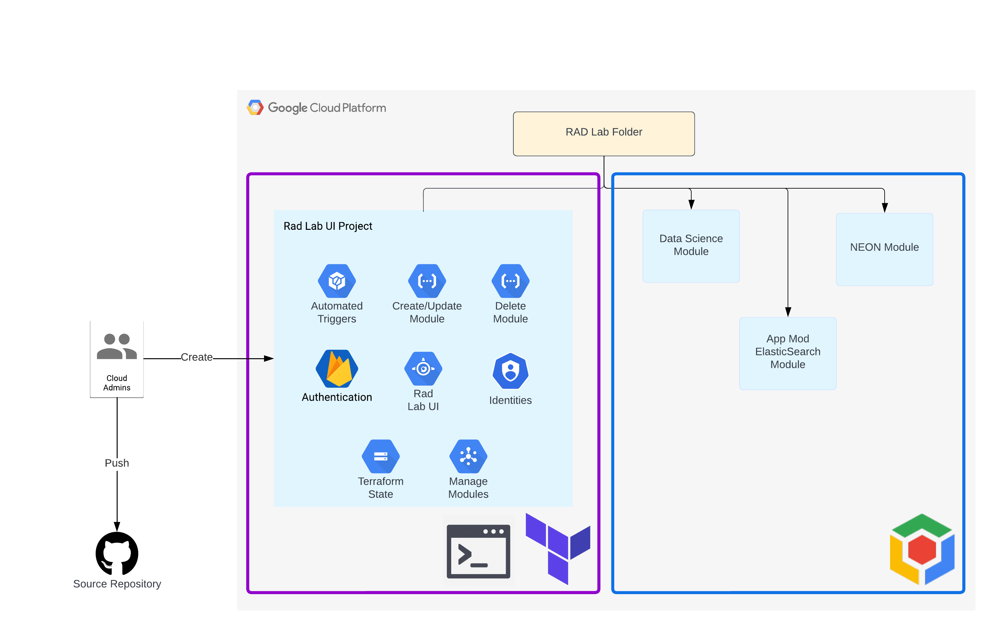

# Overview
The RAD Lab UI codebase contains the necessary Terraform and frontend code to deploy the RAD Lab UI web application in your Google Cloud organization. This guide services as a step-by-step instruction to deploy and configure everything in a secure way.

## Architecture

To install the UI, a combination of Terraform and shell scripts is used to create the necessary Google Cloud components and configure the web application. Once this step is completed, users will be able to create RAD Lab modules via the user interface (once they've been given access). The components that are part of the purple (left) box are the services used to run the user interface. The components in the blue (right) box are RAD Lab modules that are created by the user and where the lifecycle is managed via the UI.

## Components

### Terraform
As part of the installation instructions, Terraform will be used to create the following components:
- Google Cloud project (including APIs), for the UI infrastructure
- A number of Cloud Functions, which are used by the RAD Lab UI to create RAD Lab modules
- Google App Engine application to host the UI
- Firebase application to manage routing, security, etc
- Google Cloud Storage buckets for the Terraform state files, for both the UI and the individual RAD Lab modules
- Necessary service accounts with IAM permissions, needed for their activities
- Cloud Build triggers to deploy the RAD Lab modules

### Shell scripts
the cloud admin will have to run a number of shell scripts to configure the firebase application, incl. firestore rules and configuration specific to the ui.

### Manual Tasks

The manual activities can be split in two separate sections:
- Google Admin
- Firebase

#### Google Admin
To grant access to users and to ensure that the application can validate group memberships, it's necessary to create groups and assign a custom role to service accounts when installing the RAD Lab UI.

#### Firebase 
Invoking Firebase APIs via Infrastructure as Code from a terminal requires the use of a Google Cloud service account.  This is not supported by the RAD Lab UI, so the following steps have to be completed manually before the installation can be completed:
- Create the Firebase application
- Enable authentication mechanisms

