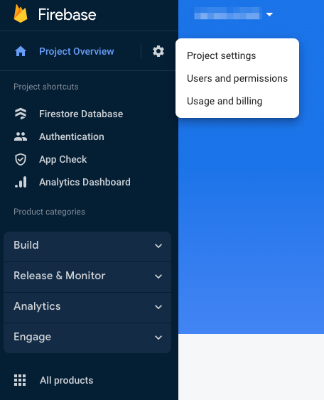
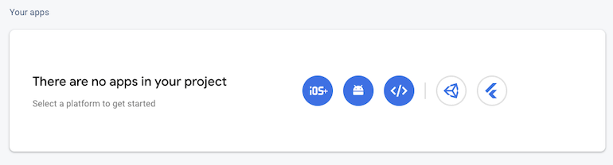
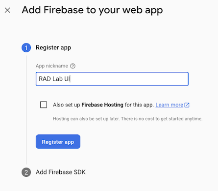
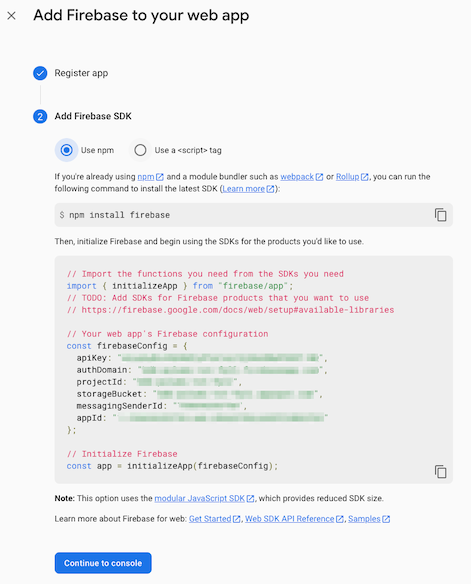

import create from "zustand";
const projectIdStore = create((set) => ({
  projectId: "",
  setProjectId: (projectId) => set({ projectId }),
}));

export const ProjectIdInput = () => {
  const setProjectId = projectIdStore((state) => state.setProjectId);
  return (
    <div>
      <label htmlFor="projectId" name="projectId">
        RAD Lab UI Project ID
      </label>
      <input
        id="projectId"
        style={{
          borderRadius: "0.25rem",
          padding: "0.5rem",
          fontSize: "1rem",
          marginLeft: "1rem",
          marginBottom: "1rem",
        }}
        type="text"
        onChange={(e) => setProjectId(e.target.value)}
      />
    </div>
  );
};

export const ProjectIdLink = ({ href, fallback, children }) => {
  const projectId = projectIdStore((state) => state.projectId);
  const interpolated =
    projectId !== "" ? href.replace("${RLUI_PROJECT_ID}", projectId) : fallback;
  return <a href={interpolated}>{children}</a>;
};

export const ProjectIdText = ({ success, fallback, children }) => {
  const projectId = projectIdStore((state) => state.projectId);
  return projectId ? success(projectId) : fallback;
};

The RAD Lab UI application is a Firebase application, which requires a number of manual steps to complete the installation.

To retrieve the correct project ID, either open a web browser and go to the [Google Cloud console](https://console.cloud.google.com) or run the following command in the `radlab-ui/automation/terraform/infrastructure` folder:

```shell
echo "$(terraform show -json | jq -r .values.outputs.project_id.value)"
```

:::important Dynamic Documentation
Add your Project ID here to have the documentation be be customized to your Google Cloud project
:::

<ProjectIdInput />

# Add Firebase

:::warning
If you've never used Firebase in your Google Cloud organization before, please follow [First Time Use](#first-time-use).  If you already have Firebase projects running in your Google Cloud organization or you have in the past, please execute [Returning Firebase User](#returning-firebase-user).

If you're not sure, simply follow the steps as described in [First Time Use](#first-time-use).
:::

## First Time Use

Open the [Firebase console](https://console.firebase.google.com) and click on "Create a project" (or add Firebase to an existing project). When prompted with "Enter your project name", enter the project ID you copied from the previous step, and accept the Firebase terms and conditions. Confirm the Firebase billing plan when prompted (and if necessary) and step through the remaining steps in the wizard.

NOTE: Firebase analytics does not impact the deployment of the RAD Lab UI application, so feel free to select whatever you think makes most sense for your deployment.

Run the following commands in a terminal or command window:

```shell
# Replace [PROJECT_ID] with the actual project ID.
export RLUI_PROJECT_ID=$(terraform show -json | jq -r .values.outputs.project_id.value)

# Install Firebase Tools
npm install -g firebase-tools

# Switch to the webapp directory (rad-lab/radlab-ui/webapp)
cd ../../../webapp

# Login to Firebase. If you are already logged in with the correct user, feel free to continue. If not, run firebase login:add and firebase login:use to select the correct user.
firebase login --no-localhost

# Set the RAD Lab UI project as the default project
firebase use ${RLUI_PROJECT_ID}

# Upload Firestore rules
firebase deploy --only firestore:rules

# Upload Firestore indexes
firebase deploy --only firestore:indexes
```

## Returning Firebase User

:::warning first time
Only execute these steps if you already have one or more Firebase applications in your Google Cloud organization.  If that is not the case, or you are not sure, please run the steps in the previous section, titled [First time Firebase use](#first-time-use).
:::

Run the following commands in a terminal or command window:

```shell
# Replace [PROJECT_ID] with the actual project ID.
export RLUI_PROJECT_ID=$(terraform show -json | jq -r .values.outputs.project_id.value)

# Install Firebase Tools
npm install -g firebase-tools

# Switch to the webapp directory
cd ../../../webapp

# Login to Firebase. If you are already logged in with the correct user, feel free to continue. If not, run firebase login:add and firebase login:use to select the correct user.
firebase login --no-localhost

# Add Firebase to the Google Cloud project
firebase projects:addfirebase ${RLUI_PROJECT_ID}

# Set the RAD Lab UI project as the default project
firebase use ${RLUI_PROJECT_ID}

# Upload Firestore rules
firebase deploy --only firestore:rules

# Upload Firestore indexes
firebase deploy --only firestore:indexes
```

## Configure the Webapp

For these next steps, open the <ProjectIdLink href="https://console.firebase.google.com/project/${RLUI_PROJECT_ID}/settings/general" fallback="https://console.firebase.google.com">Firebase Console</ProjectIdLink> and open the Project that corresponds to <ProjectIdText success={(pid) => <code>{pid}</code>} fallback={<code>$RLUI_PROJECT_ID</code>} />.

### Authentication

1. Click on **Project Overview** in the sidebar on the left
1. On the page that opens, click on **Authentication**
1. Click on **Get Started**, **Sign-in method** and select **Google** underneath **Additional providers**
1. Click on **Enable** and provide a valid **Project support email**
1. Click on **Save**

As a final step, go Authentication > Settings and click on **Authorized domains**. Add the domain of the App Engine application: <ProjectIdText success={(pid) => <code>{pid}.uc.r.appspot.com</code>} fallback={<code>$RLUI_PROJECT_ID.uc.r.appspot.com</code>} />. You can also get this value by running the following command in the `radlab-ui/automation/terraform/infrastructure` folder:

```shell
echo "$(cd ../automation/terraform/infrastructure && terraform show -json | jq -r .values.outputs.app_engine_url.value)"
```

### Firebase app

The final step is to add the configuration to your local directory. Navigate to <ProjectIdLink href="https://console.firebase.google.com/project/${RLUI_PROJECT_ID}/settings/general" fallback="https://console.firebase.google.com">Firebase Console</ProjectIdLink> and go to your Project settings:



Add a Web Application by clicking on the `</>`-icon at the bottom of the page:



Set the **App nickname** to **RAD Lab UI**, click on **Register app**:



Click on **Continue to console**.



### RAD Lab UI Configuration

We are now going to create the local configuration files to be able to deploy the web application to your Firebase environment.  To execute the steps in these sections, return to your Terminal or Cloud Shell.

:::info Environments
We are making the assumption here that both development and production will point to the same configuration. If you choose to approach this differently, feel free to update the files and use different values for your `development` and `production` environments.
:::

**Firebase Configuration**

Run `./gen_local_config.sh` and you will be prompted to provide two values:

| **Prompt**     | **Explanation**                                                                                              |
| -------------- | ------------------------------------------------------------------------------------------------------------ |
| Github API URL | API URL for your Git repository. This will be in the format https://api.github.com/repos/{owner}/{repo_name} |

This will generate two configuration files, one for local development and one for production development.

## Deploy Webapp

Run the following commands to deploy the application to your newly created Firebase environment.

```shell
# Install all components locally
npm install

# Deploy the application
npm run deploy
```

## RAD Lab UI Webpage

After successful completion, you should be able to access the RAD Lab UI via `$RLUI_PROJECT_ID.uc.r.appspot.com` in the browser.

If you are having issues signing in, please review the [Authorizing Users](../setup-gcp#authorizing-users) section.
