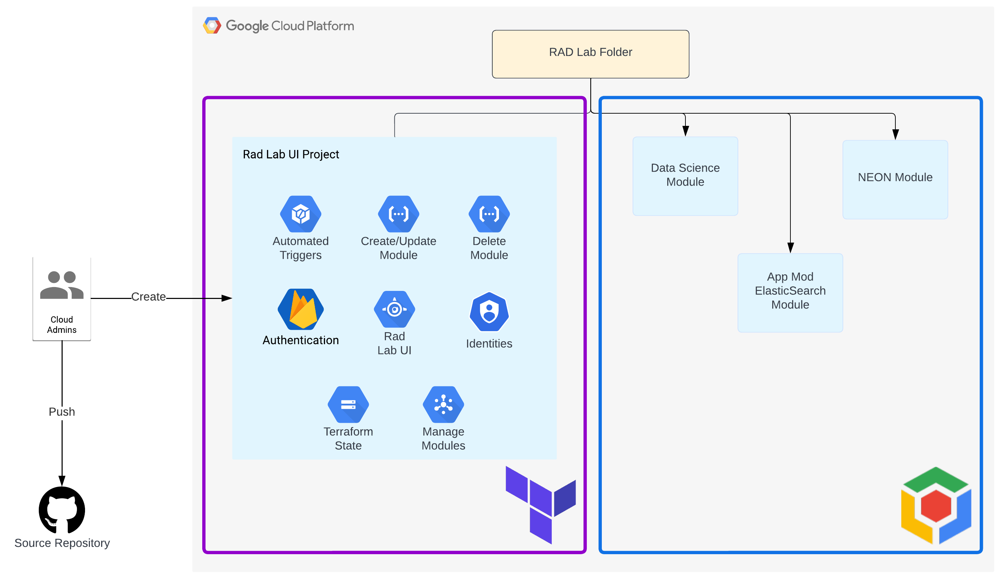

# Overview

The RAD Lab UI codebase contains the necessary Terraform and frontend code to deploy the web application in your Google Cloud organization.  This guide services as a step-by-step instruction to deploy and configure everything in a secure way.

## Architecture

## Components

The infrastructure to support the RAD Lab UI consists of the following components:
- Google Cloud project
- Pub/Sub topics to manage the asynchronous communication between the user interface and the backend
- Cloud Functions to invoke Cloud Build and deploy RAD Lab modules
- 