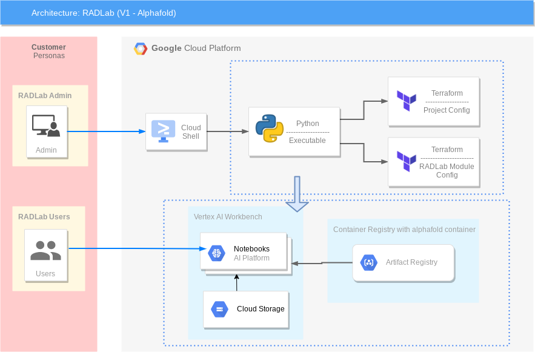

# RAD Lab alpha fold module

RAD Lab enables users to deploy infrastructure on Google Cloud Platform (GCP) to support specific use cases. Infrastructure is created and managed through [Terraform](https://www.terraform.io/) in conjunction with support scripts written in Python. 
Bio-pharma organizations can now leverage the groundbreaking protein folding system, AlphaFold, with Vertex AI
Alphafold module deployment with radlab:
1. Craetes a gcp project for researchers.
2. Enables Vertex AI APIs 
3. Deploys the alphafold container as a notebook in Vertex AI platform workbench.
We provide a customized Docker image in Artifact Registry, with preinstalled packages for launching a notebook instance in Vertex AI Workbench and prerequisites for running AlphaFold.

## GCP Products/Services
Vertex AI lets you develop the entire data science/machine learning workflow in a single development environment, helping you deploy models faster, with fewer lines of code and fewer distractions.

1. Vertex AI Workbench Notebooks with alphafold container to run alphafold demo
2. Google Cloud Storage
3. Artifact Repository to fetch the alphafold conatiner image for notebook deployment.

## Reference Architecture Diagram

Below Architechture Diagram is the base representation of what will be created as a part of [RAD Lab Launcher](../../radlab-launcher/radlab.py).

For running AlphaFold, we choose Vertex AI Workbench user-managed notebooks, which uses Jupyter notebooks and offers both various preinstalled suites of deep learning packages and full control over the environment. We also use Google Cloud Storage and Google Cloud Artifact Registry, as shown in the architecture diagram above.We provide a customized Docker image in Artifact Registry, with preinstalled packages for launching a notebook instance in Vertex AI Workbench and prerequisites for running AlphaFold.

We provide sample alphafold.ipynb upyter Notebooks as part of radlab deployment. This notebook is maintained by Vertex AI samples.

Click on this blog to learn more about using this notebook https://cloud.google.com/blog/products/ai-machine-learning/running-alphafold-on-vertexai

## IAM Permissions Prerequisites

Ensure that the identity executing this module has the following IAM permissions, **when creating the project** (`create_project` = true): 
- Parent: `roles/billing.user`
- Parent: `roles/resourcemanager.projectCreator`
- Parent: `roles/orgpolicy.policyAdmin` (OPTIONAL - Only required if setting any Org policy in `modules/[MODULE_NAME]/orgpolicy.tf` as part of RAD Lab module)

When deploying in an existing project, ensure the identity has the following permissions on the project:
- `roles/compute.admin`
- `roles/resourcemanager.projectIamAdmin`
- `roles/iam.serviceAccountAdmin`
- `roles/storage.admin`
- `roles/notebooks.admin`

NOTE: Additional [permissions](./radlab-launcher/README.md#iam-permissions-prerequisites) are required when deploying the RAD Lab modules via [RAD Lab Launcher](./radlab-launcher)

<!-- BEGIN TFDOC -->
## Variables

| name | description | type | required | default |
|---|---|:---: |:---:|:---:|
| billing_account_id | Billing Account associated to the GCP Resources | <code title="">string</code> | ✓ |  |
| *boot_disk_size_gb* | The size of the boot disk in GB attached to this instance | <code title="">number</code> |  | <code title="">100</code> |
| *boot_disk_type* | Disk types for notebook instances | <code title="">string</code> |  | <code title="">PD_SSD</code> |
| *container_image_repository* | Container Image Repo, only set if creating container image notebook instance by setting `create_container_image` variable to true | <code title="">string</code> |  | <code title="">us-west1-docker.pkg.dev/cloud-devrel-public-resources/alphafold/alphafold-on-gcp</code> |
| *container_image_tag* | Container Image Tag, only set if creating container image notebook instance by setting `create_container_image` variable to true | <code title="">string</code> |  | <code title="">latest</code> |
| *create_container_image* | If the notebook needs to have image type as Container set this variable to true, set it to false when using dafault image type i.e. VM. | <code title="">bool</code> |  | <code title="">true</code> |
| *create_network* | If the module has to be deployed in an existing network, set this variable to false. | <code title="">bool</code> |  | <code title="">true</code> |
| *create_project* | Set to true if the module has to create a project.  If you want to deploy in an existing project, set this variable to false. | <code title="">bool</code> |  | <code title="">true</code> |
| *enable_gpu_driver* | Install GPU driver on the instance | <code title="">bool</code> |  | <code title="">true</code> |
| *enable_services* | Enable the necessary APIs on the project.  When using an existing project, this can be set to false. | <code title="">bool</code> |  | <code title="">true</code> |
| *folder_id* | Folder ID where the project should be created. It can be skipped if already setting organization_id. Leave blank if the project should be created directly underneath the Organization node.  | <code title="">string</code> |  | <code title=""></code> |
| *gpu_accelerator_core_count* | Number of of GPU core count | <code title="">number</code> |  | <code title="">1</code> |
| *gpu_accelerator_type* | Type of GPU you would like to spin up | <code title="">string</code> |  | <code title="">NVIDIA_TESLA_V100</code> |
| *image_family* | Image of the Vertex AI Workbench. | <code title="">string</code> |  | <code title="">tf-latest-cpu</code> |
| *image_project* | Google Cloud project where the image is hosted. | <code title="">string</code> |  | <code title=""></code> |
| *ip_cidr_range* | Unique IP CIDR Range for Vertex AI Workbench subnet | <code title="">string</code> |  | <code title="">10.142.190.0/24</code> |
| *machine_type* | Type of VM you would like to spin up | <code title="">string</code> |  | <code title="">n1-standard-8</code> |
| *network_name* | Name of the network to be created. | <code title="">string</code> |  | <code title="">vertex-ai-workbench</code> |
| *notebook_count* | Number of Vertex AI Workbench requested | <code title="">string</code> |  | <code title="">1</code> |
| *organization_id* | Organization ID where GCP Resources need to get spin up. It can be skipped if already setting folder_id | <code title="">string</code> |  | <code title=""></code> |
| *project_name* | Project name or ID, if it's an existing project. | <code title="">string</code> |  | <code title="">radlab-alpha-fold</code> |
| *random_id* | Adds a suffix of 4 random characters to the `project_id` | <code title="">string</code> |  | <code title="">null</code> |
| *set_external_ip_policy* | Enable org policy to allow External (Public) IP addresses on virtual machines. | <code title="">bool</code> |  | <code title="">true</code> |
| *set_shielded_vm_policy* | Apply org policy to disable shielded VMs. | <code title="">bool</code> |  | <code title="">true</code> |
| *set_trustedimage_project_policy* | Apply org policy to set the trusted image projects. | <code title="">bool</code> |  | <code title="">true</code> |
| *subnet_name* | Name of the subnet where to deploy the Notebooks. | <code title="">string</code> |  | <code title="">subnet-vertex-ai-workbench</code> |
| *trusted_users* | The list of trusted users. | <code title="set&#40;string&#41;">set(string)</code> |  | <code title="">[]</code> |
| *zone* | Cloud Zone associated to the Vertex AI Workbench | <code title="">string</code> |  | <code title="">us-west1-b</code> |

## Outputs

| name | description | sensitive |
|---|---|:---:|
| deployment_id | RADLab Module Deployment ID |  |
| project-radlab-alpha-fold-id | Alpha Fold Project ID |  |
| user-scripts-bucket-uri | User Script Bucket URI |  |
| workbench-instance-names | Vertex AI Workbench Names |  |
<!-- END TFDOC -->

