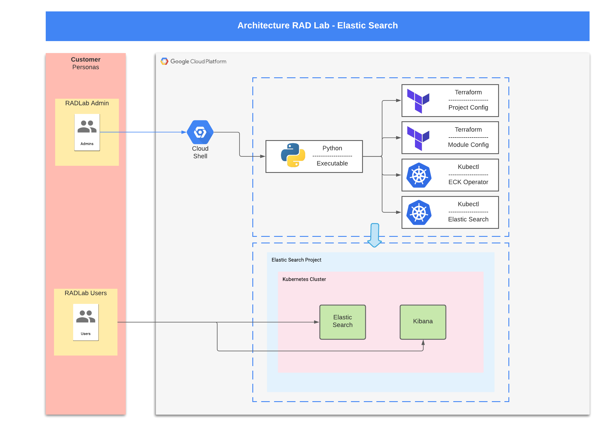

# RAD Lab Application Mordernization Module (w/ Elasticsearch) 

## Module Overview

This module allows the user to create an Elasticsearch cluster, deployed on a GKE cluster in Google Cloud Platform.  It follows the [Quickstart-tutorial](https://www.elastic.co/guide/en/cloud-on-k8s/1.8/index.html) available on https://elastic.co.   

## GCP Products/Services 

* Google Kubernetes Engine
* Virtual Private Cloud (VPC)
* Billing Budget

## Reference Architecture Diagram

Below Architechture Diagram is the base representation of what will be created as a part of [RAD Lab Launcher](../../radlab-launcher).



## API Prerequisites

In the RAD Lab Management Project make sure that _Cloud Billing Budget API (`billingbudgets.googleapis.com`)_ is enabled. 
NOTE: This is only required if spinning up Billing Budget for the module.

## IAM Permissions Prerequisites

Ensure that the identity executing this module has the following IAM permissions, when **creating the project** (create_project = true): 

- Parent: `roles/billing.user`
- Parent: `roles/billing.costsManager` (OPTIONAL - Only when spinning up Billing Budget for the module)
- Parent: `roles/resourcemanager.projectCreator`
- Parent: `roles/orgpolicy.policyAdmin` (OPTIONAL - Only required if setting any Org policy in `modules/[MODULE_NAME]/orgpolicy.tf` as part of RAD Lab module)

NOTE: Billing budgets can only be created if you are using a Service Account to deploy the module via Terraform, User account cannot be used.

When deploying in an existing project, ensure the identity has the following permissions on the project:
- `roles/compute.admin`
- `roles/container.admin`
- `roles/logging.admin`
- `roles/monitoring.admin`
- `roles/iam.serviceAccountAdmin`
- `roles/iam.serviceAccountUser`
- `roles/resourcemanager.projectIamAdmin`
- `roles/serviceusage.serviceUsageAdmin`
- `roles/billing.costsManager` (OPTIONAL - Only when spinning up Billing Budget for the module)

### Deployments via Service Account

1. Create a Terraform Service Account in RAD Lab Management Project to execute / deploy the RAD Lab module. Ensure that the Service Account has the above mentioned IAM permissions.
NOTE: Make sure to set the `resource_creator_identity` variable to the Service Account ID in terraform.tfvars file and pass it in module deployment. Example content of terraform.tfvars: 
```
resource_creator_identity = <sa>@<projectID>.iam.gserviceaccount.com 
```

2. The User, Group, or Service Account who will be deploying the module should have access to impersonate and grant it the roles, `roles/iam.serviceAccountTokenCreator` on the **Terraform Service Account’s IAM Policy**.
NOTE: This is not a Project IAM Binding; this is a **Service Account** IAM Binding.

NOTE: Additional [permissions](../../radlab-launcher/README.md#iam-permissions-prerequisites) are required when deploying the RAD Lab modules via [RAD Lab Launcher](../../radlab-launcher). Use `--disable-perm-check` or `-dc` arguments when using RAD lab Launcher for the module deployment.

_Usage:_

```python3 radlab.py --disable-perm-check --varfile /<path_to_file>/<file_with_terraform.tfvars_contents>```

### Deploy Elasticsearch
The module deploys both the ECK CRDs and Operators.  As this module can be used to demo Elasticsearch, it also deploys an ES and Kibana pod in the cluster.  This behaviour can be switched off by setting `deploy_elastic_search` to false.  This will only deploy the CRDs and Operators.

## Access Deployment 

If the user follows the standard flow of the installation, the module will deploy a pod with Kibana and a pod with ElasticSearch.  Kibana exposes a UI that can be accessed via a web browser and ElasticSearch exposes an API server that can be queried via `curl`.

### General Commands
Regardless of which service you are trying to access, these commands will have to be run in a Terminal or Cloud Shell.  

```shell
# Retrieve credentials to query the Kubernetes API server.  Replace REGION and PROJECTID with the actual values.  You can copy/paste this command from the Terraform output.
gcloud container clusters get-credentials elastic-search-cluster --region REGION --project PROJECTID

# Check status Elasticsearch. The health column should show status green.  Takes around 5 minutes to complete 
kubectl get elasticsearch -n elastic-search-demo

# Check status Kibana.  The health column should show status green.  It can take a while for the pod to become available.
kubectl get kibana -n elastic-search-demo

# Retrieve password.  Not that this stores the password as an environment variable, so only use this for testing purposes.
ES_PWD=$(kubectl get secret elastic-search-es-elastic-user -n elastic-search-demo -o go-template='{{.data.elastic | base64decode}}')
```

### ElasticSearch
ElasticSearch itself exposes an API server which can't be accessed in a web browser.  The commands listed below can be run in both a local terminal or Cloud Shell, provided that the commands listed in [General Commands](#general-commands).

```shell
# Start port-forwarding tunnel in the background
kubectl port-forward -n elastic-search-demo service/elastic-search-es-http 9200 &> /tmp/elastic_search_fwd &

# Access the API server via command line
curl -X GET -k -u elastic:$ES_PWD https://localhost:9200
```

The Elastic Search API server is now accessible on https://localhost:9200, so you can run additional commands against this endpoint, if desired.  

### Kibana

It's currently not possible to run `kubectl port-forward` and access the endpoint via the web preview **in Cloud Shell**.  The commands below have to be run from a local terminal instead.  If you use the RAD Lab launcher from Cloud Shell, you will have to execute the following commands in a terminal on your local machine.  Make sure that you are logged in with the same user locally, as the one you used to run the launcher.  You can do this by running `gcloud auth login`.

Ensure that all commands listed in [General Commands](#general-commands) have been run **before** running the command below.

```shell
# If pbcopy is not installed, only run echo $ES_PWD and copy the password manually
echo $ES_PWD | pbcopy

# Start port-forwarding tunnel
kubectl port-forward -n elastic-search-demo service/kibana-kb-http 5601

# Open a browser window and point it to https://localhost:5601. Login with username elastic and the password copied from the command above.
```
### Using Terraform module
Here are a couple of examples to directly use the Terraform module, as opposed to using the RAD Lab Launcher.

#### Simple

```hcl
module "elastic_search_simple" {
  source = "./app_mod_elastic"

  billing_account_id = "123456-123456-123456"
  organization_id    = "12345678901"
  folder_id          = "1234567890"
}
```

#### Use existing project
Replace `pref-project-id` with an existing project ID.
```hcl
module "elastic_search_project" {
  source = "./app_mod_elastic"

  billing_account_id = "123456-123456-123456"
  organization_id    = "12345678901"
  folder_id          = "1234567890"
  create_project     = false
  project_name       = "pref-project-id"
}
```

#### Use existing network
Both the project and the network has to exist already for this to work.  Additionally, if all the resources for egress traffic have already been created, set `enable_internet_egress_traffic` to **false**.  
```hcl
module "elastic_search_project" {
  source = "./app_mod_elastic"

  billing_account_id = "123456-123456-123456"
  organization_id    = "12345678901"
  folder_id          = "1234567890"
  create_project     = false
  project_name       = "pref-project-id"
  create_network     = false
  network_name       = "network-name"
  subnet_name        = "subnet-name"
}
```

<!-- BEGIN TFDOC -->
## Variables

| name | description | type | required | default |
|---|---|:---: |:---:|:---:|
| billing_account_id | Billing account ID that will be linked to the project | <code title="">string</code> | ✓ |  |
| *billing_budget_alert_spend_basis* | The type of basis used to determine if spend has passed the threshold | <code title="">string</code> |  | <code title="">CURRENT_SPEND</code> |
| *billing_budget_alert_spent_percents* | A list of percentages of the budget to alert on when threshold is exceeded | <code title="list&#40;number&#41;">list(number)</code> |  | <code title="">[0.5, 0.7, 1]</code> |
| *billing_budget_amount* | The amount to use as the budget in USD | <code title="">number</code> |  | <code title="">500</code> |
| *billing_budget_amount_currency_code* | The 3-letter currency code defined in ISO 4217 (https://cloud.google.com/billing/docs/resources/currency#list_of_countries_and_regions). It must be the currency associated with the billing account | <code title="">string</code> |  | <code title="">USD</code> |
| *billing_budget_credit_types_treatment* | Specifies how credits should be treated when determining spend for threshold calculations | <code title="">string</code> |  | <code title="">INCLUDE_ALL_CREDITS</code> |
| *billing_budget_labels* | A single label and value pair specifying that usage from only this set of labeled resources should be included in the budget | <code title="map&#40;string&#41;">map(string)</code> |  | <code title="&#123;&#125;&#10;validation &#123;&#10;condition     &#61; length&#40;var.billing_budget_labels&#41; &#60;&#61; 1&#10;error_message &#61; &#34;Only 0 or 1 labels may be supplied for the budget filter.&#34;&#10;&#125;">...</code> |
| *billing_budget_notification_email_addresses* | A list of email addresses which will be recieving billing budget notification alerts. A maximum of 4 channels are allowed as the first element of `trusted_users` is automatically added as one of the channel | <code title="set&#40;string&#41;">set(string)</code> |  | <code title="&#91;&#93;&#10;validation &#123;&#10;condition     &#61; length&#40;var.billing_budget_notification_email_addresses&#41; &#60;&#61; 4&#10;error_message &#61; &#34;Maximum of 4 email addresses are allowed for the budget monitoring channel.&#34;&#10;&#125;">...</code> |
| *billing_budget_pubsub_topic* | If true, creates a Cloud Pub/Sub topic where budget related messages will be published. Default is false | <code title="">bool</code> |  | <code title="">false</code> |
| *billing_budget_services* | A list of services ids to be included in the budget. If omitted, all services will be included in the budget. Service ids can be found at https://cloud.google.com/skus/ | <code title="list&#40;string&#41;">list(string)</code> |  | <code title="">null</code> |
| *create_budget* | If the budget should be created | <code title="">bool</code> |  | <code title="">false</code> |
| *create_network* | Indicate if the deployment has to use a network that already exists | <code title="">bool</code> |  | <code title="">true</code> |
| *create_project* | Create a new project or use an existing project.  When set to true, variable project_name has to match the exact project ID of the existing project | <code title="">bool</code> |  | <code title="">true</code> |
| *deploy_elastic_search* | Deploy Elastic Search and Kibana | <code title="">bool</code> |  | <code title="">true</code> |
| *deployment_id* | Random ID that will be used to suffix all resources.  Leave blank if you want the module to use a generated one | <code title="">string</code> |  | <code title="">null</code> |
| *disk_size_gb_nodes* | Size of the disks attached to the nodes | <code title="">number</code> |  | <code title="">256</code> |
| *disk_type_nodes* | Type of disks to attach to the nodes | <code title="">string</code> |  | <code title="">pd-standard</code> |
| *elastic_search_instance_count* | Number of instances of the Elastic Search pod | <code title="">string</code> |  | <code title="">1</code> |
| *elk_version* | Version for Elastic Search and Kibana | <code title="">string</code> |  | <code title="">7.15.1</code> |
| *enable_internet_egress_traffic* | Enable egress traffic to the internet.  Necessary to download the Elastic Search pods | <code title="">bool</code> |  | <code title="">true</code> |
| *enable_services* | Enable the necessary APIs on the project.  When using an existing project, this can be set to false | <code title="">bool</code> |  | <code title="">true</code> |
| *folder_id* | Folder ID where the project should be created. It can be skipped if already setting organization_id. Leave blank if the project should be created directly underneath the Organization node | <code title="">string</code> |  | <code title=""></code> |
| *gke_cluster_name* | Name that will be assigned to the GKE cluster | <code title="">string</code> |  | <code title="">elastic-search-cluster</code> |
| *gke_version* | Version to be used for the GKE cluster.  Ensure that the release channel is properly set when updating this variable | <code title="">string</code> |  | <code title="">1.20.10-gke.1600</code> |
| *kibana_instance_count* | Number of Kibana instances deployed in the cluster | <code title="">string</code> |  | <code title="">1</code> |
| *master_ipv4_cidr_block* | IPv4 CIDR block to assign to the Master cluster | <code title="">string</code> |  | <code title="">10.200.0.0/28</code> |
| *network_cidr_block* | CIDR block to be assigned to the network | <code title="">string</code> |  | <code title="">10.0.0.0/16</code> |
| *network_name* | Name to be assigned to the network hosting the GKE cluster | <code title="">string</code> |  | <code title="">elastic-search-nw</code> |
| *node_pool_machine_type* | Machine type for the node pool | <code title="">string</code> |  | <code title="">e2-medium</code> |
| *node_pool_max_count* | Maximum instance count for the custom node pool | <code title="">number</code> |  | <code title="">10</code> |
| *node_pool_min_count* | Minimum instance count for the custom nodepool | <code title="">number</code> |  | <code title="">1</code> |
| *node_pool_name* | Name of the nodepool | <code title="">string</code> |  | <code title="">elastic-search-pool</code> |
| *organization_id* | Organization ID where the project will be created. It can be skipped if already setting folder_id | <code title="">string</code> |  | <code title=""></code> |
| *owner_groups* | List of groups that should be added as the owner of the created project | <code title="list&#40;string&#41;">list(string)</code> |  | <code title="">[]</code> |
| *owner_users* | List of users that should be added as owner to the created project | <code title="list&#40;string&#41;">list(string)</code> |  | <code title="">[]</code> |
| *pod_cidr_block* | CIDR block to be assigned to pods running in the GKE cluster | <code title="">string</code> |  | <code title="">10.100.0.0/16</code> |
| *pod_ip_range_name* | Range name for the pod IP addresses | <code title="">string</code> |  | <code title="">pod-ip-range</code> |
| *preemptible_nodes* | Use preemptible VMs for the node pools | <code title="">bool</code> |  | <code title="">true</code> |
| *project_id_prefix* | If `create_project` is true, this will be the prefix of the Project ID & name created. If `create_project` is false this will be the actual Project ID, of the existing project where you want to deploy the module | <code title="">string</code> |  | <code title="">radlab-app-mod-elastic</code> |
| *region* | Region where the resources should be created | <code title="">string</code> |  | <code title="">us-west1</code> |
| *release_channel* | Enroll the GKE cluster in this release channel | <code title="">string</code> |  | <code title="">REGULAR</code> |
| *resource_creator_identity* | Terraform Service Account which will be creating the GCP resources. If not set, it will use user credentials spinning up the module | <code title="">string</code> |  | <code title=""></code> |
| *service_cidr_block* | CIDR block to be assigned to services running in the GKE cluster | <code title="">string</code> |  | <code title="">10.150.0.0/16</code> |
| *service_ip_range_name* | Name for the IP range for services | <code title="">string</code> |  | <code title="">service-ip-range</code> |
| *set_domain_restricted_sharing_policy* | Enable org policy to allow all principals to be added to IAM policies | <code title="">bool</code> |  | <code title="">false</code> |
| *set_shielded_vm_policy* | Apply org policy to disable shielded VMs | <code title="">bool</code> |  | <code title="">false</code> |
| *set_vpc_peering_policy* | Enable org policy to VPC Peering | <code title="">bool</code> |  | <code title="">false</code> |
| *subnet_name* | Name to be assigned to the subnet hosting the GKE cluster | <code title="">string</code> |  | <code title="">elastic-search-snw</code> |
| *trusted_groups* | The list of trusted groups (e.g. `myteam@abc.com`) | <code title="set&#40;string&#41;">set(string)</code> |  | <code title="">[]</code> |
| *trusted_users* | The list of trusted users (e.g. `username@abc.com`) | <code title="set&#40;string&#41;">set(string)</code> |  | <code title="">[]</code> |

## Outputs

| name | description | sensitive |
|---|---|:---:|
| billing_budget_budget_id | Resource name of the budget. Values are of the form `billingAccounts/{billingAccountId}/budgets/{budgetId}` | ✓ |
| cluster_credentials_cmd | None |  |
| deployment_id | RADLab Module Deployment ID |  |
| project_id | None |  |
<!-- END TFDOC -->