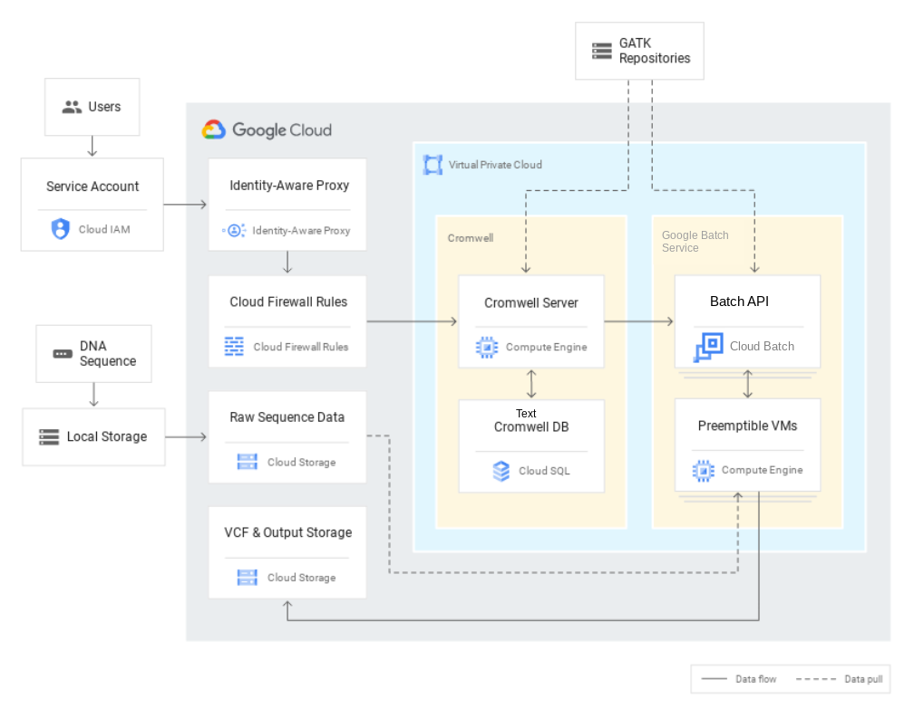

# RAD Lab Genomics-Cromwell Module

## Module Overview

Cromwell is a Workflow Management System geared towards scientific workflows. Cromwell is open sourced under the BSD 3-Clause license. Checkout Cromwell documentation at [https://cromwell.readthedocs.io/](https://cromwell.readthedocs.io/)

The RAD Lab Genomics module deploys Cromwell server along with a a CloudSQL instance and adds a firewall rule enabling access to the server through IAP Tunnel.

This setup allows you to securely access the cromwell server bu submitting jobs from your device through a secure tunnel without the need to add a public IP to your cromwell server and also access the web UI using your browser through that tunnel.

Once the module is deployed a Storage Bucket will be automtically created that will be used for workflow execution.

The outputs will include the instance name, the project name, the cromwell server instance id, the service account created and the GCS Bucket configured for workflow execution. If you are using input files that are not publicly accessible, you will need to give access to the service account.

To create the IAP tunnel on your device or from Cloud Shell, you can run the following command
`gcloud compute start-iap-tunnel <cromwell-vm> 8000 --local-host-port=localhost:8080 --zone=<zone> --project <project-id>`
* On Cloud Shell
Once you run the command above simply click on the web preview button in the top right corner of Cloud Shell, this will take you to the Swagge web UI of the Cromwell server where you can try out API and access workflow timing graphs. You can also try accessing the REST API from the CLI, for example to query the workflows open a new terminal tab and run 
`curl -X GET "http://localhost:8080/api/workflows/v1/query" -H "accept: application/json"`

* On your local device
You can start an IAP tunnel on your local device from the terminal and then from the broswer browse to http://localhost:8080 . This would also work on Chromebooks with running the command from the Linux container, note that port 8080 is already mapped to localhost, so you only need to browse to  http://localhost:8080. you can also use CLI as shown above.

## GCP Products/Services 

* Life Sciences API
* Cloud Compute
* CloudSQL
* Cloud Storage
* Virtual Private Cloud (VPC)
* Billing Budget

## Reference Architecture Diagram

Below Architechture Diagram is the base representation of what will be created as a part of [RAD Lab Launcher](../../radlab-launcher/radlab.py).



## API Prerequisites

In the RAD Lab Management Project make sure that _Cloud Billing Budget API (`billingbudgets.googleapis.com`)_ is enabled. 
NOTE: This is only required if spinning up Billing Budget for the module.

## IAM Permissions Prerequisites

Ensure that the identity executing this module has the following IAM permissions, when **creating the project** (create_project = true): 

- Parent: `roles/billing.user`
- Parent: `roles/billing.costsManager` (OPTIONAL - Only when spinning up Billing Budget for the module)
- Parent: `roles/resourcemanager.projectCreator`
- Parent: `roles/orgpolicy.policyAdmin` (OPTIONAL - Only required if setting any Org policy in `modules/[MODULE_NAME]/orgpolicy.tf` as part of RAD Lab module)

NOTE: Billing budgets can only be created if you are using a Service Account to deploy the module via Terraform, User account cannot be used.

When deploying in an existing project, ensure the identity has the following permissions on the project:
- `roles/compute.admin`
- `roles/resourcemanager.projectIamAdmin`
- `roles/iam.serviceAccountAdmin`
- `roles/storage.admin`
- `roles/billing.costsManager` (OPTIONAL - Only when spinning up Billing Budget for the module)

### Deployments via Service Account

1. Create a Terraform Service Account in RAD Lab Management Project to execute / deploy the RAD Lab module. Ensure that the Service Account has the above mentioned IAM permissions.
NOTE: Make sure to set the `resource_creator_identity` variable to the Service Account ID in terraform.tfvars file and pass it in module deployment. Example content of terraform.tfvars: 
```
resource_creator_identity = <sa>@<projectID>.iam.gserviceaccount.com 
```

2. The User, Group, or Service Account who will be deploying the module should have access to impersonate and grant it the roles, `roles/iam.serviceAccountTokenCreator` on the **Terraform Service Account’s IAM Policy**.
NOTE: This is not a Project IAM Binding; this is a **Service Account** IAM Binding.

NOTE: Additional [permissions](../../radlab-launcher/README.md#iam-permissions-prerequisites) are required when deploying the RAD Lab modules via [RAD Lab Launcher](../../radlab-launcher). Use `--disable-perm-check` or `-dc` arguments when using RAD lab Launcher for the module deployment.

_Usage:_

```python3 radlab.py --disable-perm-check --varfile /<path_to_file>/<file_with_terraform.tfvars_contents>```

<!-- BEGIN TFDOC -->
## Variables

| name | description | type | required | default |
|---|---|:---: |:---:|:---:|
| billing_account_id | Billing Account associated to the GCP Resources | <code title="">string</code> | ✓ |  |
| *billing_budget_alert_spend_basis* | The type of basis used to determine if spend has passed the threshold | <code title="">string</code> |  | <code title="">CURRENT_SPEND</code> |
| *billing_budget_alert_spent_percents* | A list of percentages of the budget to alert on when threshold is exceeded | <code title="list&#40;number&#41;">list(number)</code> |  | <code title="">[0.5, 0.7, 1]</code> |
| *billing_budget_amount* | The amount to use as the budget in USD | <code title="">number</code> |  | <code title="">500</code> |
| *billing_budget_amount_currency_code* | The 3-letter currency code defined in ISO 4217 (https://cloud.google.com/billing/docs/resources/currency#list_of_countries_and_regions). It must be the currency associated with the billing account | <code title="">string</code> |  | <code title="">USD</code> |
| *billing_budget_credit_types_treatment* | Specifies how credits should be treated when determining spend for threshold calculations | <code title="">string</code> |  | <code title="">INCLUDE_ALL_CREDITS</code> |
| *billing_budget_labels* | A single label and value pair specifying that usage from only this set of labeled resources should be included in the budget | <code title="map&#40;string&#41;">map(string)</code> |  | <code title="&#123;&#125;&#10;validation &#123;&#10;condition     &#61; length&#40;var.billing_budget_labels&#41; &#60;&#61; 1&#10;error_message &#61; &#34;Only 0 or 1 labels may be supplied for the budget filter.&#34;&#10;&#125;">...</code> |
| *billing_budget_notification_email_addresses* | A list of email addresses which will be recieving billing budget notification alerts. A maximum of 4 channels are allowed as the first element of `trusted_users` is automatically added as one of the channel | <code title="set&#40;string&#41;">set(string)</code> |  | <code title="&#91;&#93;&#10;validation &#123;&#10;condition     &#61; length&#40;var.billing_budget_notification_email_addresses&#41; &#60;&#61; 4&#10;error_message &#61; &#34;Maximum of 4 email addresses are allowed for the budget monitoring channel.&#34;&#10;&#125;">...</code> |
| *billing_budget_pubsub_topic* | If true, creates a Cloud Pub/Sub topic where budget related messages will be published. Default is false | <code title="">bool</code> |  | <code title="">false</code> |
| *billing_budget_services* | A list of services ids to be included in the budget. If omitted, all services will be included in the budget. Service ids can be found at https://cloud.google.com/skus/ | <code title="list&#40;string&#41;">list(string)</code> |  | <code title="">null</code> |
| *create_budget* | If the budget should be created | <code title="">bool</code> |  | <code title="">false</code> |
| *create_network* | If the module has to be deployed in an existing network, set this variable to false | <code title="">bool</code> |  | <code title="">true</code> |
| *create_project* | Set to true if the module has to create a project.  If you want to deploy in an existing project, set this variable to false | <code title="">bool</code> |  | <code title="">true</code> |
| *cromwell_PAPI_endpoint* | Endpoint for Life Sciences APIs. For locations other than us-central1, the endpoint needs to be updated to match the location For example for \"europe-west4\" location the endpoint-url should be \"https://europe-west4-lifesciences.googleapi/\" | <code title="">string</code> |  | <code title="">https://lifesciences.googleapis.com</code> |
| *cromwell_PAPI_location* | Google Cloud region or multi-region where the Life Sciences API endpoint will be used. This does not affect where worker instances or data will be stored | <code title="">string</code> |  | <code title="">us-central1</code> |
| *cromwell_db_name* | The name of the SQL Database instance | <code title="">string</code> |  | <code title="">cromwelldb</code> |
| *cromwell_db_tier* | CloudSQL tier, please refere to the documentation at https://cloud.google.com/sql/docs/mysql/instance-settings#machine-type-2ndgen | <code title="">string</code> |  | <code title="">db-n1-standard-2</code> |
| *cromwell_port* | Port Cromwell server will use for the REST API and web user interface | <code title="">string</code> |  | <code title="">8000</code> |
| *cromwell_sa_roles* | List of roles granted to the cromwell service account. This server account will be used to run both the Cromwell server and workers as well | <code title="list&#40;any&#41;">list(any)</code> |  | <code title="">["roles/lifesciences.workflowsRunner", "roles/serviceusage.serviceUsageConsumer", "roles/storage.objectAdmin", "roles/cloudsql.client", "roles/browser"]</code> |
| *cromwell_server_instance_name* | Name of the VM instance that will be used to deploy Cromwell Server, this should be a valid Google Cloud instance name | <code title="">string</code> |  | <code title="">cromwell-server</code> |
| *cromwell_server_instance_type* | Cromwell server instance type | <code title="">string</code> |  | <code title="">e2-standard-4</code> |
| *cromwell_version* | Cromwell version that will be downloaded, for the latest release version, please check https://github.com/broadinstitute/cromwell/releases for the latest releases | <code title="">string</code> |  | <code title="">72</code> |
| *cromwell_zones* | GCP Zones that will be set as the default runtime in Cromwell config file | <code title="list&#40;any&#41;">list(any)</code> |  | <code title="">["us-central1-a", "us-central1-b"]</code> |
| *db_service_network_cidr_range* | CIDR range used for the private service range for CloudSQL | <code title="">string</code> |  | <code title="">10.128.50.0/24</code> |
| *deployment_id* | Adds a suffix of 4 random characters to the `project_id` | <code title="">string</code> |  | <code title="">null</code> |
| *enable_services* | Enable the necessary APIs on the project.  When using an existing project, this can be set to false | <code title="">bool</code> |  | <code title="">true</code> |
| *folder_id* | Folder ID where the project should be created. It can be skipped if already setting organization_id. Leave blank if the project should be created directly underneath the Organization node | <code title="">string</code> |  | <code title=""></code> |
| *ip_cidr_range* | Unique IP CIDR Range for cromwell subnet | <code title="">string</code> |  | <code title="">10.142.190.0/24</code> |
| *network_name* | This name will be used for VPC and subnets created | <code title="">string</code> |  | <code title="">cromwell-vpc</code> |
| *organization_id* | Organization ID where GCP Resources need to get spin up. It can be skipped if already setting folder_id | <code title="">string</code> |  | <code title=""></code> |
| *owner_groups* | List of groups that should be added as the owner of the created project | <code title="list&#40;string&#41;">list(string)</code> |  | <code title="">[]</code> |
| *owner_users* | List of users that should be added as owner to the created project | <code title="list&#40;string&#41;">list(string)</code> |  | <code title="">[]</code> |
| *project_id_prefix* | If `create_project` is true, this will be the prefix of the Project ID & name created. If `create_project` is false this will be the actual Project ID, of the existing project where you want to deploy the module | <code title="">string</code> |  | <code title="">radlab-genomics-cromwell</code> |
| *region* | The default region where the CloudSQL, Compute Instance and VPCs will be deployed | <code title="">string</code> |  | <code title="">us-central1</code> |
| *resource_creator_identity* | Terraform Service Account which will be creating the GCP resources. If not set, it will use user credentials spinning up the module | <code title="">string</code> |  | <code title=""></code> |
| *set_domain_restricted_sharing_policy* | Enable org policy to allow all principals to be added to IAM policies | <code title="">bool</code> |  | <code title="">false</code> |
| *set_external_ip_policy* | If true external IP Policy will be set to allow all | <code title="">bool</code> |  | <code title="">false</code> |
| *set_shielded_vm_policy* | If true shielded VM Policy will be set to disabled | <code title="">bool</code> |  | <code title="">false</code> |
| *set_trustedimage_project_policy* | If true trusted image projects will be set to allow all | <code title="">bool</code> |  | <code title="">false</code> |
| *set_vpc_peering_policy* | If true restrict VPC peering will be set to allow all | <code title="">bool</code> |  | <code title="">false</code> |
| *trusted_groups* | The list of trusted groups (e.g. `myteam@abc.com`) | <code title="set&#40;string&#41;">set(string)</code> |  | <code title="">[]</code> |
| *trusted_users* | The list of trusted users (e.g. `username@abc.com`) | <code title="set&#40;string&#41;">set(string)</code> |  | <code title="">[]</code> |
| *zone* | The default zone where the CloudSQL, Compute Instance be deployed | <code title="">string</code> |  | <code title="">us-central1-a</code> |

## Outputs

| name | description | sensitive |
|---|---|:---:|
| billing_budget_budget_id | Resource name of the budget. Values are of the form `billingAccounts/{billingAccountId}/budgets/{budgetId}` | ✓ |
| cromwell_server_instance_id | VM instance name running the Cromwell server |  |
| cromwell_server_internal_ip | Cromwell server private IP address |  |
| cromwell_server_zone | Google Cloud zone in which the server was provisioned |  |
| cromwell_service_account_email | Email address of service account running the server and worker nodes |  |
| gcloud_iap_command | To connect to the Cromwell server using Identity Aware Proxy, run the following command |  |
| gcs_bucket_url | Google Cloud Storage Bucket configured for workflow execution |  |
| project_id | Project ID where resources where created |  |
<!-- END TFDOC -->