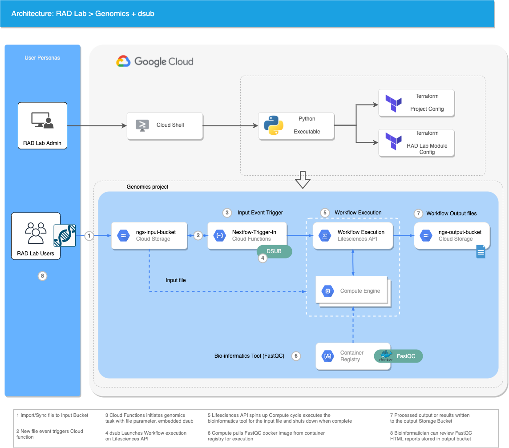

# RAD Lab Genomics Module

## GCP Products/Services 

* Cloud Functions
* Cloud Storage
* Virtual Private Cloud (VPC)
* Lifesceinces API
* Compute engine
* Container registry

## Module Overview 

This RAD Lab Genomics module demonstrates how to take a serverless approach to automate execution of pipeline jobs. e.g running QC checks on incoming fastq files using FastQC.

The module is packaged to use databiosphere dsub as a Workflow engine, containerized tools (FastQC) and Google cloud lifescience API to automate execution of pipeline jobs. The function can be easily modified to adopt to other bioinformatic tools out there.

dsub is a command-line tool that makes it easy to submit and run batch scripts in the cloud. The cloud function has embedded dsub libraries to execute pipeline jobs in Google cloud.

we will run FastQC (credit to https://www.bioinformatics.babraham.ac.uk/projects/fastqc/) as a docker container using lifesciences API against fastq files and store the QC reports generated in output GCS bucket.

Cloud Life Sciences API provides a simple way to execute a series of Compute Engine containers on Google Cloud.

FastQC tool is built as a container and stored in the Google cloud Container registry from where it can be called. 

* Once the module is deployed, to start using the pipelines, upload your fastq or fastq.qz files to the input GCS bucket (ngs-input-bucket-xxx), this automatically triggers the FastQC pipeline and the output QC reports and exeuction logs are stored in the output bucket (ngs-output-bucket-xxx)

## Reference Architechture Diagram

Below Architechture Diagram is the base representation of what will be created as a part of [RAD Lab Launcher](../../radlab-launcher/radlab.py).

## IAM Permissions Prerequisites

Ensure that the identity executing this module has the following IAM permissions, **when creating the project** (`create_project` = true): 
- Parent: `roles/orgpolicy.policyAdmin` (OPTIONAL - Only when setting the Org policy in `modules/[MODULE_NAME]/orgpolicy.tf` as part of RAD Lab module)
- Parent: `roles/resourcemanager.projectCreator`
- Project: `roles/storage.objectViewer`

Also ensure that the identity creating the resources has access to a billing account, via `roles/billing.user` and also able to view the Organization recources via, `roles/iam.organizationRoleViewer`

<!-- BEGIN TFDOC -->
## Variables

| name | description | type | required | default |
|---|---|:---: |:---:|:---:|
| billing_account_id | Billing Account associated to the GCP Resources | <code title="">string</code> | ✓ |  |
| organization_id | Organization ID where GCP Resources need to get spin up | <code title="">string</code> | ✓ |  |
| *boot_disk_size_gb* | The size of the boot disk in GB attached to this instance | <code title="">number</code> |  | <code title="">100</code> |
| *boot_disk_type* | Disk types for Lifesciences API instances | <code title="">string</code> |  | <code title="">PD_SSD</code> |
| *domain* | Display Name of Organization where GCP Resources need to get spin up | <code title="">string</code> |  | <code title=""></code> |
| *file_path* | Environment path to the respective modules (like DataScience module) which contains TF files for the same. | <code title="">string</code> |  | <code title=""></code> |
| *folder_id* | Folder ID in which GCP Resources need to get spin up | <code title="">string</code> |  | <code title=""></code> |
| *ip_cidr_range* | Unique IP CIDR Range for ngs subnet | <code title="">string</code> |  | <code title="">10.142.190.0/24</code> |
| *machine_type* | Type of VM you would like to spin up | <code title="">string</code> |  | <code title="">n1-standard-2</code> |
| *network* | Network associated to the project | <code title="">string</code> |  | <code title="">ngs-network</code> |
| *project_name* | Name of the project that should be used. | <code title="">string</code> |  | <code title="">radlab-genomics-dsub</code> |
| *random_id* | Adds a suffix of 4 random characters to the `project_id` | <code title="">string</code> |  | <code title="">null</code> |
| *region* | Cloud Zone associated to the project | <code title="">string</code> |  | <code title="">europe-west2</code> |
| *set_cloudfunctions_ingress_project_policy* | Apply org policy to set the ingress settings for cloud functions | <code title="">bool</code> |  | <code title="">true</code> |
| *set_external_ip_policy* | Enable org policy to allow External (Public) IP addresses on virtual machines. | <code title="">bool</code> |  | <code title="">true</code> |
| *set_shielded_vm_policy* | Apply org policy to disable shielded VMs. | <code title="">bool</code> |  | <code title="">true</code> |
| *set_trustedimage_project_policy* | Apply org policy to set the trusted image projects. | <code title="">bool</code> |  | <code title="">true</code> |
| *subnet* | Subnet associated with the Network | <code title="">string</code> |  | <code title="">subnet-ngs-network</code> |
| *trusted_users* | The list of trusted users. | <code title="set&#40;string&#41;">set(string)</code> |  | <code title="">[]</code> |
| *zone* | Cloud Zone associated to the project | <code title="">string</code> |  | <code title="">europe-west2-*</code> |

## Outputs

| name | description | sensitive |
|---|---|:---:|
| deployment_id | RADLab Module Deployment ID |  |
| project-radlab-genomics-id | Genomics Project ID |  |
<!-- END TFDOC -->
