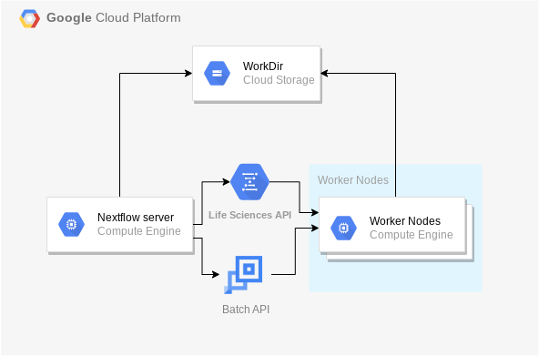

# RAD Lab Genomics-Nextflow Module

## Module Overview

Nextflow is a bioinformatics workflow manager that enables the development of portable and reproducible workflows. It supports deploying workflows on a variety of execution platforms including local, HPC schedulers, Google Cloud Life Sciences, Google Batch and Kubernetes. Additionally, it provides support for manage your workflow dependencies through built-in support for Conda, Docker. You can read more about Nextflow at [https://www.nextflow.io/docs/latest//](https://www.nextflow.io/docs/latest/)

The RAD Lab Genomics Nextflow module deploys a Nextflow server along with a Service Account and adds a firewall rule enabling access to the server through IAP Tunnel.

This setup allows you to securely access the Nextflow server through a secure tunnel without the need to add a public IP to your Nextflow.

Once the module is deployed a Storage Bucket will be automtically created that will be used for workflow execution.

The outputs will include the instance name, the project name, the nextflow server instance id, the service account created and the GCS Bucket configured for workflow execution. If you are using input files that are not publicly accessible, you will need to give access to the service account.

You can SSH to the Nextflow VM from the console or using the gcloud command in the output. You may need to wait for a few minutes for the installtion to complete, if you can see the RADLAB ascii art when you login, exit and ssh again in a few minutes.

You may recieve an error message the first time you run Nextflow, if this is the case, please update Nextflow by running `nextflow -self-update` then check the version installed by running `nextflow -v`

To test the deployment with Life Sciences API you can try to run
`nextflow -c /etc/nextflow.config run nextflow-io/hello -profile gls`
And for Batch Api run
`nextflow -c /etc/nextflow.config run nextflow-io/hello -profile gbatch`

## GCP Products/Services 

* Life Sciences API
* Batch API
* Cloud Compute
* Cloud Storage
* Virtual Private Cloud (VPC)
* Billing Budget

## Reference Architecture Diagram

Below Architechture Diagram is the base representation of what will be created as a part of [RAD Lab Launcher](../../radlab-launcher/radlab.py).

## IAM Permissions Prerequisites

Ensure that the identity executing this module has the following IAM permissions, **when creating the project** (`create_project` = true): 
- Parent: `roles/billing.user`
- Parent: `roles/resourcemanager.projectCreator`
- Parent: `roles/orgpolicy.policyAdmin` [OPTIONAL - Only required if setting Org Policies via **orgpolicy.tf** for the module]

When deploying in an existing project, ensure the identity has the following permissions on the project:
- `roles/compute.admin`
- `roles/resourcemanager.projectIamAdmin`
- `roles/iam.serviceAccountAdmin`
- `roles/storage.admin`

NOTE: Additional [permissions](./radlab-launcher/README.md#iam-permissions-prerequisites) are required when deploying the RAD Lab modules via [RAD Lab Launcher](./radlab-launcher)

<!-- BEGIN TFDOC -->
## Variables

| name | description | type | required | default |
|---|---|:---: |:---:|:---:|
| billing_account_id | Billing Account associated to the GCP Resources | <code title="">string</code> | ✓ |  |
| *billing_budget_alert_spend_basis* | The type of basis used to determine if spend has passed the threshold | <code title="">string</code> |  | <code title="">CURRENT_SPEND</code> |
| *billing_budget_alert_spent_percents* | A list of percentages of the budget to alert on when threshold is exceeded | <code title="list&#40;number&#41;">list(number)</code> |  | <code title="">[0.5,0.7,1]</code> |
| *billing_budget_amount* | The amount to use as the budget in USD | <code title="">number</code> |  | <code title="">500</code> |
| *billing_budget_amount_currency_code* | The 3-letter currency code defined in ISO 4217 (https://cloud.google.com/billing/docs/resources/currency#list_of_countries_and_regions). It must be the currency associated with the billing account | <code title="">string</code> |  | <code title="">USD</code> |
| *billing_budget_credit_types_treatment* | Specifies how credits should be treated when determining spend for threshold calculations | <code title="">string</code> |  | <code title="">INCLUDE_ALL_CREDITS</code> |
| *billing_budget_labels* | A single label and value pair specifying that usage from only this set of labeled resources should be included in the budget | <code title="map&#40;string&#41;">map(string)</code> |  | <code title="&#123;&#125;&#10;validation &#123;&#10;condition     &#61; length&#40;var.billing_budget_labels&#41; &#60;&#61; 1&#10;error_message &#61; &#34;Only 0 or 1 labels may be supplied for the budget filter.&#34;&#10;&#125;">...</code> |
| *billing_budget_notification_email_addresses* | A list of email addresses which will be recieving billing budget notification alerts. A maximum of 4 channels are allowed as the first element of `trusted_users` is automatically added as one of the channel | <code title="set&#40;string&#41;">set(string)</code> |  | <code title="&#91;&#93;&#10;validation &#123;&#10;condition     &#61; length&#40;var.billing_budget_notification_email_addresses&#41; &#60;&#61; 4&#10;error_message &#61; &#34;Maximum of 4 email addresses are allowed for the budget monitoring channel.&#34;&#10;&#125;">...</code> |
| *billing_budget_pubsub_topic* | If true, creates a Cloud Pub/Sub topic where budget related messages will be published. Default is false | <code title="">bool</code> |  | <code title="">false</code> |
| *billing_budget_services* | A list of services ids to be included in the budget. If omitted, all services will be included in the budget. Service ids can be found at https://cloud.google.com/skus/ | <code title="list&#40;string&#41;">list(string)</code> |  | <code title="">null</code> |
| *create_budget* | If the budget should be created | <code title="">bool</code> |  | <code title="">false</code> |
| *create_network* | If the module has to be deployed in an existing network, set this variable to false | <code title="">bool</code> |  | <code title="">true</code> |
| *create_project* | Set to true if the module has to create a project.  If you want to deploy in an existing project, set this variable to false | <code title="">bool</code> |  | <code title="">true</code> |
| *deployment_id* | None | <code title="">string</code> |  | <code title="">null</code> |
| *enable_services* | Enable the necessary APIs on the project.  When using an existing project, this can be set to false | <code title="">bool</code> |  | <code title="">true</code> |
| *folder_id* | Folder ID where the project should be created. It can be skipped if already setting organization_id. Leave blank if the project should be created directly underneath the Organization node | <code title="">string</code> |  | <code title=""></code> |
| *ip_cidr_range* | Unique IP CIDR Range for nextflow subnet | <code title="">string</code> |  | <code title="">10.142.190.0/24</code> |
| *network_name* | This name will be used for VPC and subnets created | <code title="">string</code> |  | <code title="">nextflow-vpc</code> |
| *nextflow_api_location* | Google Cloud region or multi-region where the Life Sciences API endpoint will be used. This does not affect where worker instances or data will be stored | <code title="">string</code> |  | <code title="">us-central1</code> |
| *nextflow_sa_roles* | List of roles granted to the nextflow service account. This server account will be used to run both the nextflow server and workers as well | <code title="list&#40;any&#41;">list(any)</code> |  | <code title="">["roles/lifesciences.workflowsRunner", "roles/serviceusage.serviceUsageConsumer", "roles/storage.objectAdmin", "roles/batch.jobsAdmin", "roles/batch.agentReporter", "roles/batch.serviceAgent", "roles/iam.serviceAccountUser", "roles/browser", "roles/logging.viewer"]</code> |
| *nextflow_server_instance_name* | Name of the VM instance that will be used to deploy nextflow Server, this should be a valid Google Cloud instance name | <code title="">string</code> |  | <code title="">nextflow-server</code> |
| *nextflow_server_instance_type* | Nextflow server instance type | <code title="">string</code> |  | <code title="">e2-standard-4</code> |
| *nextflow_zone* | GCP Zone that will be set as the default runtime in nextflow config file | <code title="">string</code> |  | <code title="">us-central1-a</code> |
| *organization_id* | Organization ID where GCP Resources need to get spin up. It can be skipped if already setting folder_id | <code title="">string</code> |  | <code title=""></code> |
| *owner_groups* | List of groups that should be added as the owner of the created project | <code title="list&#40;string&#41;">list(string)</code> |  | <code title="">[]</code> |
| *owner_users* | List of users that should be added as owner to the created project | <code title="list&#40;string&#41;">list(string)</code> |  | <code title="">[]</code> |
| *project_id_prefix* | If `create_project` is true, this will be the prefix of the Project ID & name created. If `create_project` is false this will be the actual Project ID, of the existing project where you want to deploy the module | <code title="">string</code> |  | <code title="">radlab-genomics-nextflow</code> |
| *region* | The default region where the Compute Instance and VPCs will be deployed | <code title="">string</code> |  | <code title="">us-central1</code> |
| *resource_creator_identity* | Terraform Service Account which will be creating the GCP resources. If not set, it will use user credentials spinning up the module | <code title="">string</code> |  | <code title=""></code> |
| *set_domain_restricted_sharing_policy* | Enable org policy to allow all principals to be added to IAM policies | <code title="">bool</code> |  | <code title="">false</code> |
| *set_shielded_vm_policy* | If true shielded VM Policy will be set to disabled | <code title="">bool</code> |  | <code title="">false</code> |
| *set_trustedimage_project_policy* | If true trusted image projects will be set to allow all | <code title="">bool</code> |  | <code title="">false</code> |
| *subnet_name* | This name will be used for subnet created | <code title="">string</code> |  | <code title="">nextflow-vpc</code> |
| *trusted_groups* | The list of trusted groups (e.g. `myteam@abc.com`) | <code title="set&#40;string&#41;">set(string)</code> |  | <code title="">[]</code> |
| *trusted_users* | The list of trusted users (e.g. `username@abc.com`) | <code title="set&#40;string&#41;">set(string)</code> |  | <code title="">[]</code> |
| *zone* | The default zone where the Compute Instance be deployed | <code title="">string</code> |  | <code title="">us-central1-a</code> |

## Outputs

| name | description | sensitive |
|---|---|:---:|
| gcloud_ssh_command | To connect to the Nextflow instance using Identity Aware Proxy, run the following command |  |
| gcs_bucket_url | Google Cloud Storage Bucket configured for workflow execution |  |
| nextflow_server_instance_id | VM instance name running the nextflow server |  |
| nextflow_server_zone | Google Cloud zone in which the server was provisioned |  |
| nextflow_service_account_email | Email address of service account running the server and worker nodes |  |
| project_id | Project ID where resources where created |  |
<!-- END TFDOC -->