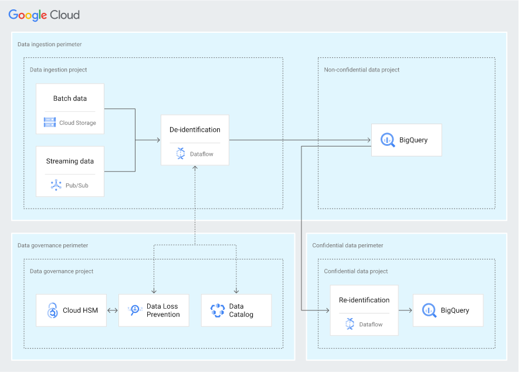

# RAD Lab Secure Data Warehouse Module

This RAD Lab module is intended for data engineers and security administrators who deploy and secure data warehouses using BigQuery to store confidential data. We have wrapped the [Secure Datawarehouse Blueprint](https://cloud.google.com/architecture/confidential-data-warehouse-blueprint) and referenced terraform configs from [GitHub](https://github.com/GoogleCloudPlatform/terraform-google-secured-data-warehouse) and Terraform [Registry](https://registry.terraform.io/modules/GoogleCloudPlatform/secured-data-warehouse/google/latest/examples/simple-example).

## GCP Products/Services 

* BigQuery
* Cloud Storage
* Billing Budget
* Big Query
* Dataflow
* Cloud Storage
* PubSub
* Data Catalog
* Cloud HSM
* DLP

## Reference Architecture Diagram

Below Architechture Diagram is the base representation of what will be created as a part of [RAD Lab Launcher](../../radlab-launcher/radlab.py).



## API Prerequisites

In the RAD Lab Management Project make sure that _Cloud Billing Budget API (`billingbudgets.googleapis.com`)_ is enabled. 
NOTE: This is only required if spinning up Billing Budget for the module.

## IAM Permissions Prerequisites

Ensure that the identity (Service Account) executing this module has the following IAM permissions, when **creating the project** (create_project = true): 

- Parent: `roles/accesscontextmanager.policyAdmin`
- Parent: `roles/billing.user`
- Parent: `roles/resourcemanager.projectCreator`
- Parent: `roles/orgpolicy.policyAdmin`
- Parent: `roles/resourcemanager.organizationAdmin`

OPTIONAL `roles/billing.costsManager` role on Parent is only required when spinning up Billing Budget for the module

NOTE: Billing budgets can only be created if you are using a Service Account to deploy the module via Terraform, User account cannot be used.

## Access Context Manager 

Before deploying the module create the [Create a scoped access policy](https://cloud.google.com/access-context-manager/docs/create-access-policy#scoped-access-policy) on Folder level where the Secure Data Warehouse is supose to be deployed.

```
gcloud access-context-manager policies create --organization ORGANIZATION_ID --scopes="folders/FOLDER_ID" --title secure-data-warehouse
```

### Deployments via Service Account

1. When deploying the module via RAD Lab Launcher, create a Terraform Service Account in RAD Lab Management Project to execute / deploy the RAD Lab module. Ensure that the Service Account has the above mentioned IAM permissions.
NOTE: Make sure to set the `resource_creator_identity` variable to the Service Account ID in terraform.tfvars file and pass it in module deployment. Example content of terraform.tfvars: 
```
resource_creator_identity = <sa>@<projectID>.iam.gserviceaccount.com 
```

NOTE: Make sure that the `secure_datawarehouse_service_acccount` is same as `resource_creator_identity` when trying to deploying the module via RAD Lab Launcher.

2. The User, Group, or Service Account who will be deploying the module should have access to impersonate and grant it the roles, `roles/iam.serviceAccountTokenCreator` on the **Terraform Service Account’s IAM Policy**.
NOTE: This is not a Project IAM Binding; this is a **Service Account** IAM Binding.

NOTE: Additional [permissions](../../radlab-launcher/README.md#iam-permissions-prerequisites) are required when deploying the RAD Lab modules via [RAD Lab Launcher](../../radlab-launcher). Use `--disable-perm-check` or `-dc` arguments when using RAD lab Launcher for the module deployment.

_Usage:_

```python3 radlab.py --disable-perm-check --varfile /<path_to_file>/<file_with_terraform.tfvars_contents>```

The following APIs must be enabled in the RAD Lab Management Project where the service account was created
- Access Context Manager API: `accesscontextmanager.googleapis.com`
- App Engine Admin API: `appengine.googleapis.com`
- Cloud Billing API: `cloudbilling.googleapis.com`
- Cloud Key Management Service (KMS) API: `cloudkms.googleapis.com`
- Cloud Pub/Sub API: `pubsub.googleapis.com`
- Cloud Resource Manager API: `cloudresourcemanager.googleapis.com`
- Compute Engine API: `compute.googleapis.com`
- Dataflow API: `dataflow.googleapis.com`
- Identity and Access Management (IAM) API: `iam.googleapis.com`

<!-- BEGIN TFDOC -->
## Variables

| name | description | type | required | default |
|---|---|:---: |:---:|:---:|
| billing_account_id | Billing Account associated to the GCP Resources | <code title="">string</code> | ✓ |  |
| data_analyst_group | Google Cloud IAM group that analyzes the data in the warehouse | <code title="">string</code> | ✓ |  |
| data_engineer_group | Google Cloud IAM group that sets up and maintains the data pipeline and warehouse | <code title="">string</code> | ✓ |  |
| network_administrator_group | Google Cloud IAM group that reviews network configuration. Typically, this includes members of the networking team | <code title="">string</code> | ✓ |  |
| perimeter_additional_members | The list of all members (users or service accounts) to be added on perimeter access, except the service accounts created by this module | <code title="list&#40;string&#41;">list(string)</code> | ✓ |  |
| secure_datawarehouse_service_acccount | Terraform Service Account for Secure Data Warehouse module. NOTE: This should be same as RAD Lab UI Module creator Service Account | <code title="">string</code> | ✓ |  |
| security_administrator_group | Google Cloud IAM group that administers security configurations in the organization(org policies, KMS, VPC service perimeter) | <code title="">string</code> | ✓ |  |
| security_analyst_group | Google Cloud IAM group that monitors and responds to security incidents | <code title="">string</code> | ✓ |  |
| *access_context_manager_policy_id* | The id of the default Access Context Manager policy. Can be obtained by running `gcloud access-context-manager policies list --organization YOUR-ORGANIZATION_ID --format=\"value(name)\"` | <code title="">string</code> |  | <code title=""></code> |
| *billing_budget_alert_spend_basis* | The type of basis used to determine if spend has passed the threshold | <code title="">string</code> |  | <code title="">CURRENT_SPEND</code> |
| *billing_budget_alert_spent_percents* | A list of percentages of the budget to alert on when threshold is exceeded | <code title="list&#40;number&#41;">list(number)</code> |  | <code title="">[0.5, 0.7, 1]</code> |
| *billing_budget_amount* | The amount to use as the budget in USD | <code title="">number</code> |  | <code title="">500</code> |
| *billing_budget_amount_currency_code* | The 3-letter currency code defined in ISO 4217 (https://cloud.google.com/billing/docs/resources/currency#list_of_countries_and_regions). It must be the currency associated with the billing account | <code title="">string</code> |  | <code title="">USD</code> |
| *billing_budget_credit_types_treatment* | Specifies how credits should be treated when determining spend for threshold calculations | <code title="">string</code> |  | <code title="">INCLUDE_ALL_CREDITS</code> |
| *billing_budget_labels* | A single label and value pair specifying that usage from only this set of labeled resources should be included in the budget | <code title="map&#40;string&#41;">map(string)</code> |  | <code title="&#123;&#125;&#10;validation &#123;&#10;condition     &#61; length&#40;var.billing_budget_labels&#41; &#60;&#61; 1&#10;error_message &#61; &#34;Only 0 or 1 labels may be supplied for the budget filter.&#34;&#10;&#125;">...</code> |
| *billing_budget_notification_email_addresses* | A list of email addresses which will be recieving billing budget notification alerts. A maximum of 4 channels are allowed as the first element of `trusted_users` is automatically added as one of the channel | <code title="set&#40;string&#41;">set(string)</code> |  | <code title="&#91;&#93;&#10;validation &#123;&#10;condition     &#61; length&#40;var.billing_budget_notification_email_addresses&#41; &#60;&#61; 4&#10;error_message &#61; &#34;Maximum of 4 email addresses are allowed for the budget monitoring channel.&#34;&#10;&#125;">...</code> |
| *billing_budget_pubsub_topic* | If true, creates a Cloud Pub/Sub topic where budget related messages will be published. Default is false | <code title="">bool</code> |  | <code title="">false</code> |
| *billing_budget_services* | A list of services ids to be included in the budget. If omitted, all services will be included in the budget. Service ids can be found at https://cloud.google.com/skus/ | <code title="list&#40;string&#41;">list(string)</code> |  | <code title="">null</code> |
| *confidential_tags* | A full person name, which can include first names, middle names or initials, and last names | <code title="map&#40;object&#40;&#123;&#10;display_name  &#61; string&#10;description   &#61; string&#10;&#125;&#41;&#41;">map(object({...}))</code> |  | <code title="&#123;&#10;name &#61; &#123;&#10;display_name    &#61; &#34;FULL_NAME&#34;&#10;&#125;&#10;&#125;">...</code> |
| *create_budget* | If the budget should be created | <code title="">bool</code> |  | <code title="">false</code> |
| *data_fields* | Data fields for schema of the data. List of `types` - https://cloud.google.com/bigquery/docs/schemas#standard_sql_data_types, List of mode - https://cloud.google.com/bigquery/docs/schemas#modes   | <code title="map&#40;object&#40;&#123;&#10;mode  &#61; string&#10;type &#61; string&#10;&#125;&#41;&#41;">map(object({...}))</code> |  | <code title="&#123;&#10;email &#61; &#123;&#10;mode  &#61; &#34;NULLABLE&#34;&#10;type &#61; &#34;STRING&#34;&#10;&#125;,&#10;name &#61; &#123;&#10;mode  &#61; &#34;NULLABLE&#34;&#10;type &#61; &#34;STRING&#34;&#10;&#125;,&#10;street &#61; &#123;&#10;mode  &#61; &#34;NULLABLE&#34;&#10;type &#61; &#34;STRING&#34;&#10;&#125;,&#10;city &#61; &#123;&#10;mode  &#61; &#34;NULLABLE&#34;&#10;type &#61; &#34;STRING&#34;&#10;&#125;,&#10;state &#61; &#123;&#10;mode  &#61; &#34;NULLABLE&#34;&#10;type &#61; &#34;STRING&#34;&#10;&#125;,&#10;zip &#61; &#123;&#10;mode  &#61; &#34;NULLABLE&#34;&#10;type &#61; &#34;INTEGER&#34;&#10;&#125;,&#10;dob &#61; &#123;&#10;mode  &#61; &#34;NULLABLE&#34;&#10;type &#61; &#34;DATE&#34;&#10;&#125;,&#10;dl_id &#61; &#123;&#10;mode  &#61; &#34;NULLABLE&#34;&#10;type &#61; &#34;STRING&#34;&#10;&#125;,&#10;exp_date &#61; &#123;&#10;mode  &#61; &#34;NULLABLE&#34;&#10;type &#61; &#34;DATE&#34;&#10;&#125;&#10;&#125;">...</code> |
| *dataset_location* | The regional location for the dataset only US and EU are allowed in module | <code title="">string</code> |  | <code title="">US</code> |
| *deidentified_fields* | Provide list of fields / columns need to get de-identified | <code title="list&#40;string&#41;">list(string)</code> |  | <code title="">["email", "dl_id"]</code> |
| *delete_contents_on_destroy* | (Optional) If set to true, delete all the tables in the dataset when destroying the resource; otherwise, destroying the resource will fail if tables are present | <code title="">bool</code> |  | <code title="">true</code> |
| *deployment_id* | Adds a suffix of 4 random characters to the `project_id` | <code title="">string</code> |  | <code title="">null</code> |
| *folder_id* | Folder ID where the project should be created. It can be skipped if already setting organization_id. Leave blank if the project should be created directly underneath the Organization node | <code title="">string</code> |  | <code title=""></code> |
| *organization_id* | Organization ID where GCP Resources need to get spin up. It can be skipped if already setting folder_id | <code title="">string</code> |  | <code title=""></code> |
| *owner_groups* | List of groups that should be added as the owner of the created project | <code title="list&#40;string&#41;">list(string)</code> |  | <code title="">[]</code> |
| *owner_users* | List of users that should be added as owner to the created project | <code title="list&#40;string&#41;">list(string)</code> |  | <code title="">[]</code> |
| *private_tags* | Date of Birth of the person | <code title="map&#40;object&#40;&#123;&#10;display_name  &#61; string&#10;description   &#61; string&#10;&#125;&#41;&#41;">map(object({...}))</code> |  | <code title="&#123;&#10;dob &#61; &#123;&#10;display_name    &#61; &#34;DOB&#34;&#10;&#125;&#10;&#125;">...</code> |
| *project_id_prefix* | This will be the prefix of the Project ID & name created | <code title="">string</code> |  | <code title="">radlab-sdw</code> |
| *region* | The default region where the resources will be deployed | <code title="">string</code> |  | <code title="">us-east4</code> |
| *resource_creator_identity* | Terraform Service Account which will be creating the GCP resources. If not set, it will use user credentials spinning up the module | <code title="">string</code> |  | <code title=""></code> |
| *sensitive_tags* | Driver License document ID | <code title="map&#40;object&#40;&#123;&#10;display_name  &#61; string&#10;description   &#61; string&#10;&#125;&#41;&#41;">map(object({...}))</code> |  | <code title="&#123;&#10;dl_id &#61; &#123;&#10;display_name    &#61; &#34;DRIVER_LICENSE_ID&#34;&#10;&#125;&#10;&#125;">...</code> |
| *set_domain_restricted_sharing_policy* | Enable org policy to allow all principals to be added to IAM policies | <code title="">bool</code> |  | <code title="">false</code> |
| *set_shielded_vm_policy* | Apply org policy to disable shielded VMs | <code title="">bool</code> |  | <code title="">false</code> |
| *source_data_gcs_objects* | List of GCS URIs of the CSV data files. Example Format - 'gs://ci-bq-external-data/hive_partition_example/year=2012/foo.csv'. NOTE: Make sure that the RAD Lab UI module creator Service Account has read access to the GCS objects added to this list | <code title="list&#40;string&#41;">list(string)</code> |  | <code title="">[]</code> |
| *subnet_ip* | The CDIR IP range of the subnetwork | <code title="">string</code> |  | <code title="">10.0.0.0/16</code> |
| *trusted_groups* | The list of trusted groups (e.g. `myteam@abc.com`) | <code title="set&#40;string&#41;">set(string)</code> |  | <code title="">[]</code> |
| *trusted_users* | The list of trusted users (e.g. `username@abc.com`) | <code title="set&#40;string&#41;">set(string)</code> |  | <code title="">[]</code> |

## Outputs

| name | description | sensitive |
|---|---|:---:|
| billing_budget_budget_id | Resource name of the budget. Values are of the form `billingAccounts/{billingAccountId}/budgets/{budgetId}` | ✓ |
| blueprint_type | Type of blueprint this module represents. |  |
| cmek_bigquery_crypto_key | The Customer Managed Crypto Key for the BigQuery service. |  |
| cmek_confidential_bigquery_crypto_key | The Customer Managed Crypto Key for the confidential BigQuery service. |  |
| cmek_data_ingestion_crypto_key | The Customer Managed Crypto Key for the data ingestion crypto boundary. |  |
| cmek_reidentification_crypto_key | The Customer Managed Crypto Key for the reidentification crypto boundary. |  |
| confidential_data_access_level_name | Confidential Data Access Context Manager access level name. |  |
| confidential_data_service_perimeter_name | Confidential Data VPC Service Controls service perimeter name |  |
| data_governance_access_level_name | Data Governance Access Context Manager access level name. |  |
| data_governance_service_perimeter_name | Data Governance VPC Service Controls service perimeter name. |  |
| data_ingestion_access_level_name | Data Ingestion Access Context Manager access level name. |  |
| data_ingestion_bigquery_dataset | The bigquery dataset created for data ingestion pipeline. |  |
| data_ingestion_bucket_name | The name of the bucket created for the data ingestion pipeline. |  |
| data_ingestion_service_perimeter_name | Data Ingestion VPC Service Controls service perimeter name. |  |
| data_ingestion_topic_name | The topic created for data ingestion pipeline. |  |
| dataflow_controller_service_account_email | The Dataflow controller service account email. See https://cloud.google.com/dataflow/docs/concepts/security-and-permissions#specifying_a_user-managed_controller_service_account. |  |
| deployment_id | RADLab Module Deployment ID |  |
| project_confedential_data | Confedential Data Project |  |
| project_data_governance | Data Governance Project |  |
| project_data_ingestion | Data Ingestion Project |  |
| project_non_confedential_data | Non-Confedential Data Project |  |
| project_template | Template Project |  |
| pubsub_writer_service_account_email | The PubSub writer service account email. Should be used to write data to the PubSub topics the data ingestion pipeline reads from. |  |
| storage_writer_service_account_email | The Storage writer service account email. Should be used to write data to the buckets the data ingestion pipeline reads from. |  |
<!-- END TFDOC -->