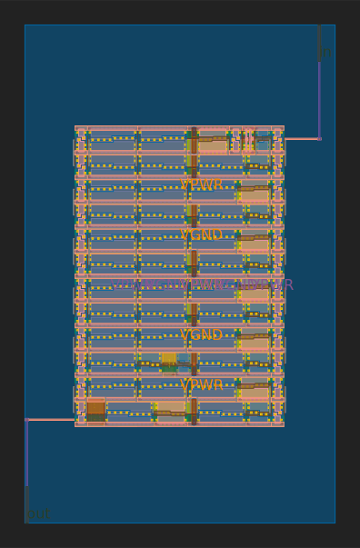
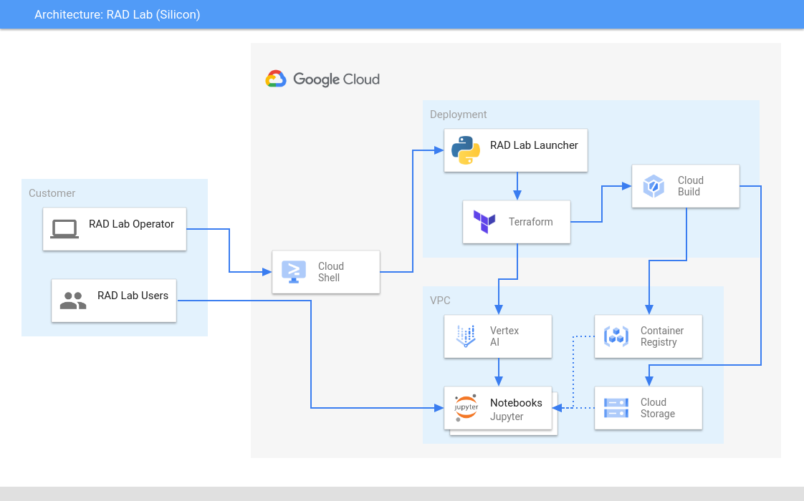

# RAD Lab Silicon Module

## Module Overview

This RAD Lab module provides a managed environment for custom Silicon design using Open Source ASIC toolchains.

### Tools

- [JupyterLab](https://jupyter.org/)
- [SkyWater Open Source PDK](https://github.com/google/skywater-pdk)
- [OpenLane](https://github.com/The-OpenROAD-Project/OpenLane)

### Samples notebooks

- [Inverter](scripts/build/notebooks/inverter.md)



## GCP Products/Services 

* AI Platform Notebooks
* Virtual Private Cloud (VPC)
* Cloud Storage
* Cloud Build
* Container Registry
* Billing Budget

## Reference Architecture Diagram

Below Architecture Diagram is the base representation of what will be created as a part of [RAD Lab Launcher](../../radlab-launcher/radlab.py).



## API Prerequisites

In the RAD Lab Management Project make sure that _Cloud Billing Budget API (`billingbudgets.googleapis.com`)_ is enabled. 
NOTE: This is only required if spinning up Billing Budget for the module.

## IAM Permissions Prerequisites

Ensure that the identity executing this module has the following IAM permissions, when **creating the project** (create_project = true): 

- Parent: `roles/billing.user`
- Parent: `roles/billing.costsManager` (OPTIONAL - Only when spinning up Billing Budget for the module)
- Parent: `roles/resourcemanager.projectCreator`
- Parent: `roles/orgpolicy.policyAdmin` (OPTIONAL - Only required if setting any Org policy in `modules/[MODULE_NAME]/orgpolicy.tf` as part of RAD Lab module)

NOTE: Billing budgets can only be created if you are using a Service Account to deploy the module via Terraform, User account cannot be used.

When deploying in an existing project, ensure the identity has the following permissions on the project:
- `roles/notebooks.admin`
- `roles/compute.admin`
- `roles/cloudbuild.builds.editor`
- `roles/artifactregistry.admin`
- `roles/storage.admin`
- `roles/resourcemanager.projectIamAdmin`
- `roles/iam.serviceAccountAdmin`
- `roles/iam.serviceAccountUser`
- `roles/serviceusage.serviceUsageConsumer`
- `roles/billing.costsManager` (OPTIONAL - Only when spinning up Billing Budget for the module)

### Deployments via Service Account

1. Create a Terraform Service Account in RAD Lab Management Project to execute / deploy the RAD Lab module. Ensure that the Service Account has the above mentioned IAM permissions.
NOTE: Make sure to set the `resource_creator_identity` variable to the Service Account ID in terraform.tfvars file and pass it in module deployment. Example content of terraform.tfvars: 
```
resource_creator_identity = <sa>@<projectID>.iam.gserviceaccount.com 
```

2. The User, Group, or Service Account who will be deploying the module should have access to impersonate and grant it the roles, `roles/iam.serviceAccountTokenCreator` on the **Terraform Service Account’s IAM Policy**.
NOTE: This is not a Project IAM Binding; this is a **Service Account** IAM Binding.

NOTE: Additional [permissions](../../radlab-launcher/README.md#iam-permissions-prerequisites) are required when deploying the RAD Lab modules via [RAD Lab Launcher](../../radlab-launcher). Use `--disable-perm-check` or `-dc` arguments when using RAD lab Launcher for the module deployment.

_Usage:_

```python3 radlab.py --disable-perm-check --varfile /<path_to_file>/<file_with_terraform.tfvars_contents>```

## Using Terraform module
Here are a couple of examples to use the module directly in your Terraform code, as opposed to using the RAD Lab Launcher.
> NOTE: This module can take upto **50 minutes** to get completely deployed.

### Simple

```hcl
module "simple" {
  source = "./modules/silicon"

  billing_account_id = "123456-123456-123465"
  organization_id    = "12345678901"
  folder_id          = "1234567890"
}
```
### Use existing project

This example assumes that all the necessary APIs have been enabled as well.

````hcl
module "existing_project" {
  source = "./modules/silicon"

  billing_account_id = "123456-123456-123465"
  organization_id    = "12345678901"
  folder_id          = "1234567890"

  create_project  = false
  project_name    = "silicon-project-id"
  enable_services = false
  
  set_external_ip_policy          = false
  set_shielded_vm_policy          = false
}
````

### Existing network

```hcl
module "existing_project_and_network" {
  source = "./modules/silicon"

  billing_account_id = "123456-123456-123465"
  organization_id    = "12345678901"
  folder_id          = "1234567890"

  create_project  = false
  project_name    = "silicon-project-id"
  enable_services = false
  enable_services = false
  
  create_network = false
  network_name   = "silicon-network"
  subnet_name    = "silicon-subnetwork"

  set_external_ip_policy          = false
  set_shielded_vm_policy          = false
}
```

<!-- BEGIN TFDOC -->
## Variables

| name | description | type | required | default |
|---|---|:---: |:---:|:---:|
| billing_account_id | Billing Account associated to the GCP Resources | <code title="">string</code> | ✓ |  |
| *billing_budget_alert_spend_basis* | The type of basis used to determine if spend has passed the threshold | <code title="">string</code> |  | <code title="">CURRENT_SPEND</code> |
| *billing_budget_alert_spent_percents* | A list of percentages of the budget to alert on when threshold is exceeded | <code title="list&#40;number&#41;">list(number)</code> |  | <code title="">[0.5, 0.7, 1]</code> |
| *billing_budget_amount* | The amount to use as the budget in USD | <code title="">number</code> |  | <code title="">500</code> |
| *billing_budget_amount_currency_code* | The 3-letter currency code defined in ISO 4217 (https://cloud.google.com/billing/docs/resources/currency#list_of_countries_and_regions). It must be the currency associated with the billing account | <code title="">string</code> |  | <code title="">USD</code> |
| *billing_budget_credit_types_treatment* | Specifies how credits should be treated when determining spend for threshold calculations | <code title="">string</code> |  | <code title="">INCLUDE_ALL_CREDITS</code> |
| *billing_budget_labels* | A single label and value pair specifying that usage from only this set of labeled resources should be included in the budget | <code title="map&#40;string&#41;">map(string)</code> |  | <code title="&#123;&#125;&#10;validation &#123;&#10;condition     &#61; length&#40;var.billing_budget_labels&#41; &#60;&#61; 1&#10;error_message &#61; &#34;Only 0 or 1 labels may be supplied for the budget filter.&#34;&#10;&#125;">...</code> |
| *billing_budget_notification_email_addresses* | A list of email addresses which will be recieving billing budget notification alerts. A maximum of 4 channels are allowed as the first element of `trusted_users` is automatically added as one of the channel | <code title="set&#40;string&#41;">set(string)</code> |  | <code title="&#91;&#93;&#10;validation &#123;&#10;condition     &#61; length&#40;var.billing_budget_notification_email_addresses&#41; &#60;&#61; 4&#10;error_message &#61; &#34;Maximum of 4 email addresses are allowed for the budget monitoring channel.&#34;&#10;&#125;">...</code> |
| *billing_budget_pubsub_topic* | If true, creates a Cloud Pub/Sub topic where budget related messages will be published. Default is false | <code title="">bool</code> |  | <code title="">false</code> |
| *billing_budget_services* | A list of services ids to be included in the budget. If omitted, all services will be included in the budget. Service ids can be found at https://cloud.google.com/skus/ | <code title="list&#40;string&#41;">list(string)</code> |  | <code title="">null</code> |
| *boot_disk_size_gb* | The size of the boot disk in GB attached to this instance | <code title="">number</code> |  | <code title="">100</code> |
| *boot_disk_type* | Disk types for notebook instances | <code title="">string</code> |  | <code title="">PD_SSD</code> |
| *create_budget* | If the budget should be created | <code title="">bool</code> |  | <code title="">false</code> |
| *create_network* | If the module has to be deployed in an existing network, set this variable to false | <code title="">bool</code> |  | <code title="">true</code> |
| *create_project* | Set to true if the module has to create a project.  If you want to deploy in an existing project, set this variable to false | <code title="">bool</code> |  | <code title="">true</code> |
| *deployment_id* | Adds a suffix of 4 random characters to the `project_id` | <code title="">string</code> |  | <code title="">null</code> |
| *enable_services* | Enable the necessary APIs on the project.  When using an existing project, this can be set to false | <code title="">bool</code> |  | <code title="">true</code> |
| *folder_id* | Folder ID where the project should be created. It can be skipped if already setting organization_id. Leave blank if the project should be created directly underneath the Organization node | <code title="">string</code> |  | <code title=""></code> |
| *image_name* | Basename for for the compute and container image | <code title="">string</code> |  | <code title="">silicon-design-ubuntu-2004</code> |
| *ip_cidr_range* | Unique IP CIDR Range for AI Notebooks subnet | <code title="">string</code> |  | <code title="">10.142.190.0/24</code> |
| *machine_type* | Type of VM you would like to spin up | <code title="">string</code> |  | <code title="">n1-standard-1</code> |
| *network_name* | Name of the network to be created | <code title="">string</code> |  | <code title="">ai-notebook</code> |
| *notebook_count* | Number of AI Notebooks requested | <code title="">number</code> |  | <code title="">1</code> |
| *notebook_names* | Names of AI Notebooks requested | <code title="list&#40;string&#41;">list(string)</code> |  | <code title="">[]</code> |
| *organization_id* | Organization ID where GCP Resources need to get spin up. It can be skipped if already setting folder_id | <code title="">string</code> |  | <code title=""></code> |
| *owner_groups* | List of groups that should be added as the owner of the created project | <code title="list&#40;string&#41;">list(string)</code> |  | <code title="">[]</code> |
| *owner_users* | List of users that should be added as owner to the created project | <code title="list&#40;string&#41;">list(string)</code> |  | <code title="">[]</code> |
| *project_id_prefix* | If `create_project` is true, this will be the prefix of the Project ID & name created. If `create_project` is false this will be the actual Project ID, of the existing project where you want to deploy the module | <code title="">string</code> |  | <code title="">radlab-silicon</code> |
| *resource_creator_identity* | Terraform Service Account which will be creating the GCP resources. If not set, it will use user credentials spinning up the module | <code title="">string</code> |  | <code title=""></code> |
| *set_domain_restricted_sharing_policy* | Enable org policy to allow all principals to be added to IAM policies | <code title="">bool</code> |  | <code title="">false</code> |
| *set_external_ip_policy* | Enable org policy to allow External (Public) IP addresses on virtual machines | <code title="">bool</code> |  | <code title="">false</code> |
| *set_shielded_vm_policy* | Apply org policy to disable shielded VMs | <code title="">bool</code> |  | <code title="">false</code> |
| *set_trustedimage_project_policy* | Apply org policy to set the trusted image projects | <code title="">bool</code> |  | <code title="">false</code> |
| *subnet_name* | Name of the subnet where to deploy the Notebooks | <code title="">string</code> |  | <code title="">subnet-ai-notebook</code> |
| *trusted_groups* | The list of trusted groups (e.g. `myteam@abc.com`) | <code title="set&#40;string&#41;">set(string)</code> |  | <code title="">[]</code> |
| *trusted_users* | The list of trusted users (e.g. `username@abc.com`) | <code title="set&#40;string&#41;">set(string)</code> |  | <code title="">[]</code> |
| *zone* | Cloud Zone associated to the AI Notebooks | <code title="">string</code> |  | <code title="">us-east4-c</code> |

## Outputs

| name | description | sensitive |
|---|---|:---:|
| artifact_registry_repository_id | Artifact Registry Repository ID |  |
| billing_budget_budget_id | Resource name of the budget. Values are of the form `billingAccounts/{billingAccountId}/budgets/{budgetId}` | ✓ |
| deployment_id | RAD Lab Module Deployment ID |  |
| notebook_container_image | Container Image URI |  |
| notebook_instance_names | Notebook Instance Names |  |
| notebook_urls | URLs for the notebook that was created in this module. |  |
| notebooks_bucket_name | Notebooks GCS Bucket Name |  |
| project_id | Silicon RAD Lab Project ID |  |
<!-- END TFDOC -->

## Access RAD Lab Silicon Notebooks

Follow the instructions under [gcp-ai-nootbook-tools Readme](./scripts/usage/README.md).
