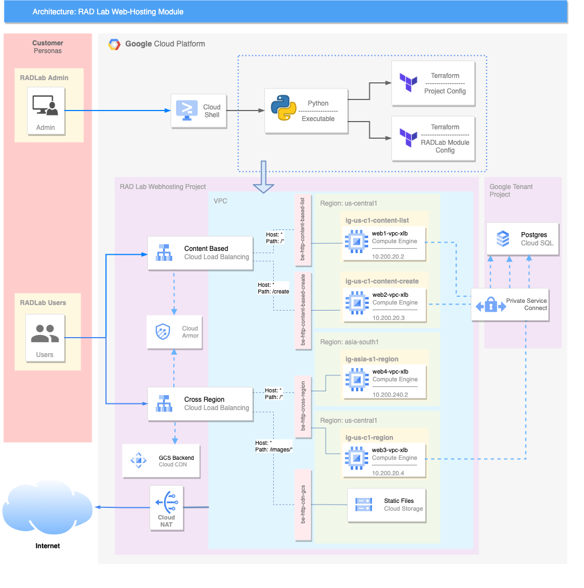

# RAD Lab Web Hosting Module

## Module Overview

This RAD Lab module builds a 3-tier application architecture which is a modular client-server architecture that consists of a presentation tier, an application tier and a data tier. The data tier stores information, the application tier handles logic and the presentation tier is a graphical user interface (GUI) that communicates with the other two tiers. This modules spins up a sample app aka registration form which takes data from UI (Presentation Layer), process the data on GCE servers (application layer) and selects or insert data into Cloud SQL Postgres DB (database layer)

NOTE: Once the deployment is completed wait for ~10 minutes for the Application and the DB server to roll out completely and the LoadBalancer Health checks to pass for backends to come up successdully. 

## GCP Products/Services

* Virtual Private Cloud (VPC)
* Compute Engine: Virtual Machines
* Cloud NAT
* Cloud Load Balancing
* Cloud Armor
* Clous CDN
* Cloud Storage
* Cloud SQL
* Billing Budget

## Reference Architecture Diagram

Below Architechture Diagram is the base representation of what will be created as a part of [RAD Lab Launcher](../../radlab-launcher/radlab.py).



## API Prerequisites

In the RAD Lab Management Project make sure that _Cloud Billing Budget API (`billingbudgets.googleapis.com`)_ is enabled. 
NOTE: This is only required if spinning up Billing Budget for the module.

## IAM Permissions Prerequisites

Ensure that the identity executing this module has the following IAM permissions, **when creating the project** (`create_project` = true): 
- Parent: `roles/billing.user`
- Parent: `roles/billing.costsManager` (OPTIONAL - Only when spinning up Billing Budget for the module)
- Parent: `roles/resourcemanager.projectCreator`
- Parent: `roles/orgpolicy.policyAdmin` (OPTIONAL - Only required if setting any Org policy in `modules/[MODULE_NAME]/orgpolicy.tf` as part of RAD Lab module)

NOTE: Billing budgets can only be created if you are using a Service Account to deploy the module via Terraform, User account cannot be used.

When deploying in an existing project, ensure the identity has the following permissions on the project:
- `roles/compute.admin`
- `roles/resourcemanager.projectIamAdmin`
- `roles/iam.serviceAccountAdmin`
- `roles/storage.admin`

NOTE: Additional [permissions](./radlab-launcher/README.md#iam-permissions-prerequisites) are required when deploying the RAD Lab modules via [RAD Lab Launcher](./radlab-launcher)

### Deployments via Service Account

1. Create a Terraform Service Account in RAD Lab Management Project to execute / deploy the RAD Lab module. Ensure that the Service Account has the above mentioned IAM permissions.
NOTE: Make sure to set the `resource_creator_identity` variable to the Service Account ID in terraform.tfvars file and pass it in module deployment. Example content of terraform.tfvars: 
```
resource_creator_identity = <sa>@<projectID>.iam.gserviceaccount.com 
```

2. The User, Group, or Service Account who will be deploying the module should have access to impersonate and grant it the roles, `roles/iam.serviceAccountTokenCreator` on the **Terraform Service Account’s IAM Policy**.
NOTE: This is not a Project IAM Binding; this is a **Service Account** IAM Binding.

NOTE: Additional [permissions](../../radlab-launcher/README.md#iam-permissions-prerequisites) are required when deploying the RAD Lab modules via [RAD Lab Launcher](../../radlab-launcher). Use `--disable-perm-check` or `-dc` arguments when using RAD lab Launcher for the module deployment.

_Usage:_

```python3 radlab.py --disable-perm-check --varfile /<path_to_file>/<file_with_terraform.tfvars_contents>```

<!-- BEGIN TFDOC -->
## Variables

| name | description | type | required | default |
|---|---|:---: |:---:|:---:|
| billing_account_id | Billing Account associated to the GCP Resources | <code title="">string</code> | ✓ |  |
| *billing_budget_alert_spend_basis* | The type of basis used to determine if spend has passed the threshold | <code title="">string</code> |  | <code title="">CURRENT_SPEND</code> |
| *billing_budget_alert_spent_percents* | A list of percentages of the budget to alert on when threshold is exceeded | <code title="list&#40;number&#41;">list(number)</code> |  | <code title="">[0.5, 0.7, 1]</code> |
| *billing_budget_amount* | The amount to use as the budget in USD | <code title="">number</code> |  | <code title="">500</code> |
| *billing_budget_amount_currency_code* | The 3-letter currency code defined in ISO 4217 (https://cloud.google.com/billing/docs/resources/currency#list_of_countries_and_regions). It must be the currency associated with the billing account | <code title="">string</code> |  | <code title="">USD</code> |
| *billing_budget_credit_types_treatment* | Specifies how credits should be treated when determining spend for threshold calculations | <code title="">string</code> |  | <code title="">INCLUDE_ALL_CREDITS</code> |
| *billing_budget_labels* | A single label and value pair specifying that usage from only this set of labeled resources should be included in the budget | <code title="map&#40;string&#41;">map(string)</code> |  | <code title="&#123;&#125;&#10;validation &#123;&#10;condition     &#61; length&#40;var.billing_budget_labels&#41; &#60;&#61; 1&#10;error_message &#61; &#34;Only 0 or 1 labels may be supplied for the budget filter.&#34;&#10;&#125;">...</code> |
| *billing_budget_notification_email_addresses* | A list of email addresses which will be recieving billing budget notification alerts. A maximum of 4 channels are allowed as the first element of `trusted_users` is automatically added as one of the channel | <code title="set&#40;string&#41;">set(string)</code> |  | <code title="&#91;&#93;&#10;validation &#123;&#10;condition     &#61; length&#40;var.billing_budget_notification_email_addresses&#41; &#60;&#61; 4&#10;error_message &#61; &#34;Maximum of 4 email addresses are allowed for the budget monitoring channel.&#34;&#10;&#125;">...</code> |
| *billing_budget_pubsub_topic* | If true, creates a Cloud Pub/Sub topic where budget related messages will be published. Default is false | <code title="">bool</code> |  | <code title="">false</code> |
| *billing_budget_services* | A list of services ids to be included in the budget. If omitted, all services will be included in the budget. Service ids can be found at https://cloud.google.com/skus/ | <code title="list&#40;string&#41;">list(string)</code> |  | <code title="">null</code> |
| *create_budget* | If the budget should be created | <code title="">bool</code> |  | <code title="">false</code> |
| *create_project* | Set to true if the module has to create a project.  If you want to deploy in an existing project, set this variable to false | <code title="">bool</code> |  | <code title="">true</code> |
| *db_activation_policy* | This specifies when the instance should be active | <code title="">string</code> |  | <code title="">ALWAYS</code> |
| *db_availability_type* | The availability type of the Cloud SQL instance | <code title="">string</code> |  | <code title="">REGIONAL</code> |
| *db_disk_type* | The type of data disk | <code title="">string</code> |  | <code title="">PD_SSD</code> |
| *db_ipv4_enabled* | Whether this Cloud SQL instance should be assigned a public IPV4 address | <code title="">bool</code> |  | <code title="">false</code> |
| *db_tier* | The machine type to use. Postgres supports only shared-core machine types, and custom machine types such as `db-custom-2-13312` | <code title="">string</code> |  | <code title="">db-g1-small</code> |
| *db_version* | PostgreSQL Server version to use | <code title="">string</code> |  | <code title="POSTGRES_12&#10;validation &#123;&#10;condition     &#61; substr&#40;var.db_version, 0, 8&#41; &#61;&#61; &#34;POSTGRES&#34;&#10;error_message &#61; &#34;Only POSTGRESQL Server is Supported.&#34;&#10;&#125;">...</code> |
| *deployment_id* | Adds a suffix of 4 random characters to the `project_id` | <code title="">string</code> |  | <code title="">null</code> |
| *enable_services* | Enable the necessary APIs on the project.  When using an existing project, this can be set to false | <code title="">bool</code> |  | <code title="">true</code> |
| *folder_id* | Folder ID where the project should be created. It can be skipped if already setting organization_id. Leave blank if the project should be created directly underneath the Organization node | <code title="">string</code> |  | <code title=""></code> |
| *ip_cidr_ranges* | Unique IP CIDR Range for Primary & Secondary subnet | <code title="set&#40;string&#41;">set(string)</code> |  | <code title="">["10.200.20.0/24", "10.200.240.0/24"]</code> |
| *network_name* | Name of the VPC network to be created | <code title="">string</code> |  | <code title="">vpc-xlb</code> |
| *organization_id* | Organization ID where GCP Resources need to get spin up. It can be skipped if already setting folder_id | <code title="">string</code> |  | <code title=""></code> |
| *owner_groups* | List of groups that should be added as the owner of the created project | <code title="list&#40;string&#41;">list(string)</code> |  | <code title="">[]</code> |
| *owner_users* | List of users that should be added as owner to the created project | <code title="list&#40;string&#41;">list(string)</code> |  | <code title="">[]</code> |
| *project_id_prefix* | If `create_project` is true, this will be the prefix of the Project ID & name created. If `create_project` is false this will be the actual Project ID, of the existing project where you want to deploy the module | <code title="">string</code> |  | <code title="">radlab-web-hosting</code> |
| *region* | Primary region where the CloudSQL, Compute Instance and VPC subnet will be deployed | <code title="">string</code> |  | <code title="">us-central1</code> |
| *region_secondary* | Secondary region where the Compute Instance and VPC subnet will be deployed | <code title="">string</code> |  | <code title="">asia-south1</code> |
| *resource_creator_identity* | Terraform Service Account which will be creating the GCP resources. If not set, it will use user credentials spinning up the module | <code title="">string</code> |  | <code title=""></code> |
| *set_bucket_level_access_policy* | Apply org policy to disable Uniform Bucket Level Access on GCS | <code title="">bool</code> |  | <code title="">false</code> |
| *set_domain_restricted_sharing_policy* | Enable org policy to allow all principals to be added to IAM policies | <code title="">bool</code> |  | <code title="">false</code> |
| *set_shielded_vm_policy* | Apply org policy to disable shielded VMs | <code title="">bool</code> |  | <code title="">false</code> |
| *trusted_groups* | The list of trusted groups (e.g. `myteam@abc.com`) | <code title="set&#40;string&#41;">set(string)</code> |  | <code title="">[]</code> |
| *trusted_users* | The list of trusted users (e.g. `username@abc.com`) | <code title="set&#40;string&#41;">set(string)</code> |  | <code title="">[]</code> |

## Outputs

| name | description | sensitive |
|---|---|:---:|
| billing_budget_budget_id | Resource name of the budget. Values are of the form `billingAccounts/{billingAccountId}/budgets/{budgetId}` | ✓ |
| deployment_id | RAD Lab Module Deployment ID |  |
| lb_content_based | URLs to Content Based Load Balancer |  |
| lb_region_based | URL to Region Based Load Balancer |  |
| lb_region_based_cdn_gcs | URL to Region Based Load Balancer with Cloud Storage Static Objects with CDN |  |
| project_id | Web Hosting RAD Lab Project ID |  |
<!-- END TFDOC -->

